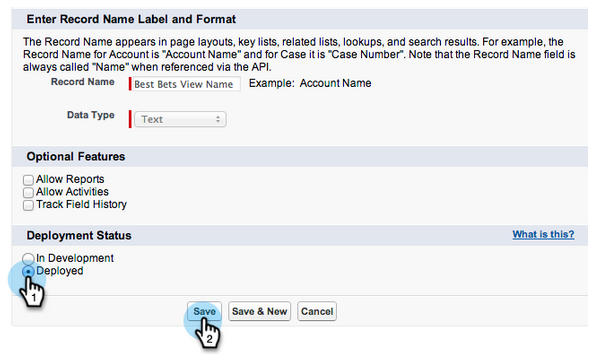

# [!DNL Salesforce] AppExchange での [!DNL Marketo Sales Insight] パッケージのインストール {#install-marketo-sales-insight-package-in-salesforce-appexchange}

[!DNL Sales Insight] が提供するすべての優れた機能を利用するには、[!DNL Salesforce] サブスクリプションに [!DNL Marketo Sales Insight] アプリをインストールする必要があります。手順は次のとおりです。

>[!NOTE]
>
>**管理者権限が必要**

>[!NOTE]
>
>[!DNL Marketo Sales Insight] は、[!DNL Salesforce] Platform（Shield）Encryption と互換性があります。

1. [ [!DNL Marketo Sales Insight] の AppExchange ページ](https://appexchange.salesforce.com/listingDetail?listingId=a0N30000001SVZmEAO)に移動し、「**[!UICONTROL 今すぐ取得]**」をクリックします。

   

1. 「**[!UICONTROL AppExchange にログイン]**」ボタンをクリックし、[!DNL Salesforce] の資格情報を使用してログインします。

1. 接続した [!DNL Salesforce] アカウントログインを入力し、「**[!UICONTROL 実稼動環境にインストール]**」をクリックします。

   

   >[!TIP]
   >
   >最初にサンドボックスでテストする場合は、「**[!UICONTROL サンドボックスにインストール]**」を選択します。

1. 利用規約を読んで承諾し、「**[!UICONTROL 確認してインストール]**」をクリックします。

   

1. 「[!UICONTROL 管理者専用にインストール]」（および後で特定のプロファイルに MSI アクセスを提供）、「[!UICONTROL すべてのユーザ用にインストール]」、「[!UICONTROL 特定のプロファイル用にインストール]」を選択できます。

   

1. インストールプロセスを開始すると、次のメッセージが表示される場合があります。インストールが完了次第、メールでお知らせします。「**完了**」をクリックして閉じます。

   

1. **[!UICONTROL Marketo セールスインサイト]**&#x200B;がインストール済みパッケージに含まれていることを確認します。

   

1. 名前の横にある「**[!UICONTROL 設定]**」をクリックします。

   

1. 「[!UICONTROL オブジェクト]」を検索し、「**[!UICONTROL 作成]**」の下の「**[!UICONTROL オブジェクト]**」をクリックします。

   

1. すべての [!DNL Marketo Sales Insight] 項目で、「**[!UICONTROL デプロイ済み]**」がチェックされていることを再確認します。

   

1. オブジェクトがデプロイされていない場合は、項目の横にある「**[!UICONTROL 編集]**」をクリックします。

   

1. **[!UICONTROL デプロイメントステータス]**&#x200B;セクションで、「**[!UICONTROL デプロイ済み]**」を選択し、「**[!UICONTROL 保存]**」をクリックします。

   

これで完了です。これで、[!DNL Marketo Sales Insight] のインストールとデプロイが完了しました。あとは、セールスチーム向けの設定を進めて、セールスが急上昇するのを楽しみに待ちましょう。

>[!MORELIKETHIS]
>
>* [ [!DNL Salesforce]  Professional Edition での  [!DNL Marketo Sales Insight]  の設定](/help/marketo/product-docs/marketo-sales-insight/msi-for-salesforce/configuration/configure-marketo-sales-insight-in-salesforce-professional-edition.md)
>* [ [!DNL Salesforce]  Enterprise／Unlimited での  [!DNL Marketo Sales Insight]  の設定](/help/marketo/product-docs/marketo-sales-insight/msi-for-salesforce/configuration/configure-marketo-sales-insight-in-salesforce-enterprise-unlimited.md)
>* [Sales Insight へのアクセスをプロファイルに追加](/help/marketo/product-docs/marketo-sales-insight/msi-for-salesforce/configuration/add-sales-insight-access-to-profiles.md){target="_blank"}
