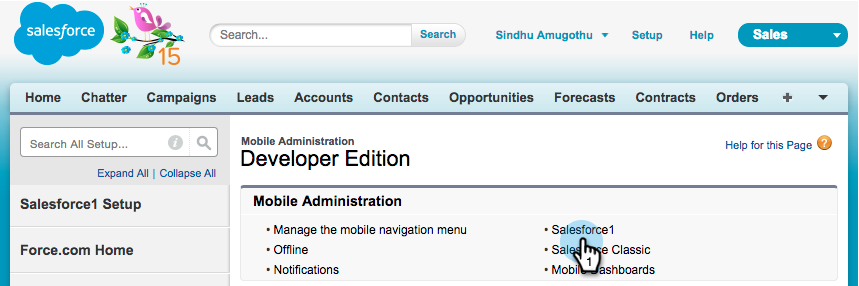

# Marketor Sales InsightのSalesforce1でのインストールと設定 {#install-and-configure-marketo-sales-insight-in-salesforce}

>[!NOTE]
>
>**Reminder**
>
>既存のお客様は、MSIパッケージを [アップグレードしてから](http://docs.marketo.com/x/_gU6Ag) 、続行してください。

>[!PREREQUISITES]
>
>Salesforce Enterprise/Unlimitedをお持ちの場合：
>
>* [手順1/3:Salesforce追加に対するマーケティング担当者のフィールド(Enterprise/Unlimited)](../../../../product-docs/crm-sync/salesforce-sync/setup/enterprise-unlimited-edition/step-1-of-3-add-marketo-fields-to-salesforce-enterprise-unlimited.md)
>* [手順2/3:Marketor向けSalesforceユーザーの作成(Enterprise/Unlimited)](../../../../product-docs/crm-sync/salesforce-sync/setup/enterprise-unlimited-edition/step-2-of-3-create-a-salesforce-user-for-marketo-enterprise-unlimited.md)
>* [手順3/3:MarketoとSalesforceの連携(Enterprise/Unlimited)](../../../../product-docs/crm-sync/salesforce-sync/setup/enterprise-unlimited-edition/step-3-of-3-connect-marketo-and-salesforce-enterprise-unlimited.md)
>* [Salesforce Enterprise/UnlimitedでのMarketor Sales Insightの設定](../../../../product-docs/marketo-sales-insight/msi-for-salesforce/configuration/configure-marketo-sales-insight-in-salesforce-enterprise-unlimited.md)

>
>
Salesforce Professionalをお持ちの場合：
>
>* [Salesforce Professional EditionでのMarketor Sales Insightの設定](../../../../product-docs/marketo-sales-insight/msi-for-salesforce/configuration/configure-marketo-sales-insight-in-salesforce-professional-edition.md)

>

>[!NOTE]
>
>Salesforce1のMarketo Sales Insightには、次のものが含まれます。ベストベット、リードフィード、注目すべき瞬間、追加およびマーケティングキャンペーンへ。

1. Salesforce1モバイルアプリを有効にする
1. 「 **設定** 」をクリックし、「 **モバイル管理**」をクリックします。

   

1. 「 **Salesforce1**」をクリックします。

   

1. 「 **Salesforce1 Settings**」をクリックします。

   

1. [Salesforce1モバイルブラウザアプリを **有効にする**]をクリックします。

   

1. 「 **保存**」をクリックします。

   

1. 「 **モバイル管理**」を選択します。

   

1. 「モバイルナビゲーションメニューを **管理**」をクリックします。

   

1. 「**Marketto **」と「****」を追加選択して、「**選択された**メニュー」項目に移動します。

   

1. 「 **Marketo**」を選択し、**Up ***を目的の領域に移動し、「 **保存**」をクリックします。

   

1. 古いマーケティングカスタムオブジェクトを隠す
1. 「 **設定**」をクリックします。

   

1. 「ユーザー **の管理**」を選択します。

   

1. 「 **プロファイル**」を選択します。

   

1. ***必要なプロファイルを**編集します。

   

1. 「 **タブの設定**」で、 *最初のマー* ケティング先を選択します ****。

   ** 

   **

1. 「 **タブを非表示**」を選択します。

   ** 

   **

   >[!NOTE]
   >
   >必ず、目的のプロファイルの「マーケティング」タブを非表示にしてください。

1. タブのカスタマイズ
1. ** +**をクリックします。

   

1. [ **マイタブのカスタマイズ**]をクリックします。

   

1. 「 **Marketto** 」を選択し、「Selected Tabs」に「**追加 **it」を選択します。

   

1. 「 **Marketo**」を選択し、**Up ***を目的の領域に移動し、「 **保存**」をクリックします。

   

1. ページレイアウトのカスタマイズ
1. 「 **設定**」をクリックします。

   

1. 「 **設定**」をクリックし、「 **ページレイアウト**」と入力し、「リード」の下の「 **ページレイアウト** 」をクリックします。

   >[!NOTE]
   >
   >貴社が使用するすべてのページレイアウト（マーケティング、販売など）に対して手順を繰り返します。 Contact、AccountおよびOpportunityオブジェクトの場合。

   

1. 「 **編集** 」をクリックして、リードのレイアウトを変更します。

   

1. 「**Visualforce Pages」をクリック **し、「Lead Mobile **** 」を「Mobile Cards」セクションにドラッグします。

   

1. 「高さ」を66に変更し、「 **OK**」をクリックします。

   

1. 「 **フィールド** 」をクリックし、**追加をMarkettoキャンペーン **** の「Marketto Sales Insight **」セクションにドラッグします。

   

   >[!TIP]
   >
   >クイックフィンドに「追加to」と入力すると、マーケティングキャンペーン追加を簡単に見つけることができます。

1. 「 **保存**」をクリックします。

   

フィー！ Marketo Sales Insight for Salesforce1のインストールが完了しました。 後ろを軽く叩いてみなさい。

>[!NOTE]
>
>**関連記事**
>
>* [Salesforceのベストベット1](best-bets-in-salesforce1.md)
>* [Salesforce1の興味深い瞬間](interesting-moments-in-salesforce1.md)
>* [SalesforceでのMarketo電子メール、キャンペーン、およびウォッチリストのアクションの送信1](send-marketo-email-and-campaign-and-watchlist-actions-in-salesforce1.md)

>

