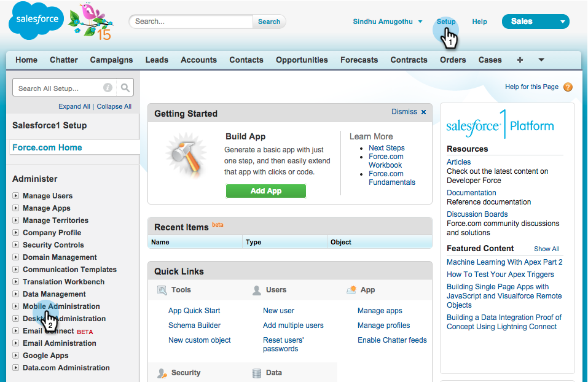
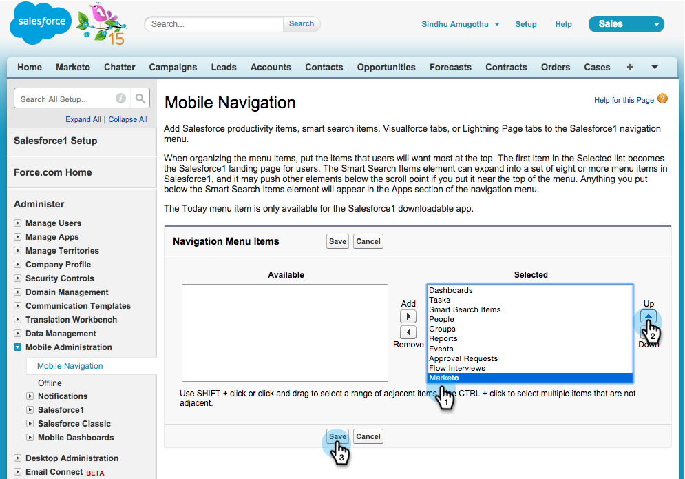
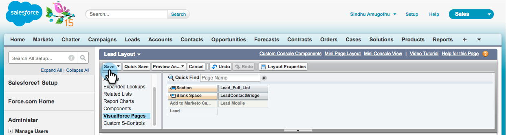

# Salesforce1 での Marketo Sales Insight のインストールおよび設定 {#install-and-configure-marketo-sales-insight-in-salesforce}

>[!NOTE]
>
>既存のお客様の場合は、続ける前に [MSI パッケージをアップグレード](/help/marketo/product-docs/marketo-sales-insight/msi-for-salesforce/upgrading/upgrading-your-msi-package.md)してください。

>[!PREREQUISITES]
>
>Salesforce Enterprise／Unlimited をお持ちの場合：
>
>* [手順 1／3：Marketo フィールドの Salesforce への追加（Enterprise／Unlimited）](/help/marketo/product-docs/crm-sync/salesforce-sync/setup/enterprise-unlimited-edition/step-1-of-3-add-marketo-fields-to-salesforce-enterprise-unlimited.md)
>* [手順 2／3：Marketo 用の Salesforce ユーザーの作成（Enterprise／Unlimited）](/help/marketo/product-docs/crm-sync/salesforce-sync/setup/enterprise-unlimited-edition/step-2-of-3-create-a-salesforce-user-for-marketo-enterprise-unlimited.md)
>* [手順 3／3：Marketo と Salesforce の接続（Enterprise／Unlimited）](/help/marketo/product-docs/crm-sync/salesforce-sync/setup/enterprise-unlimited-edition/step-3-of-3-connect-marketo-and-salesforce-enterprise-unlimited.md)
>* [Salesforce Enterprise／Unlimited での Marketo Sales Insight の設定](/help/marketo/product-docs/marketo-sales-insight/msi-for-salesforce/configuration/configure-marketo-sales-insight-in-salesforce-enterprise-unlimited.md)

>
>Salesforce Professional をお持ちの場合：
>
>* [Salesforce Professional Edition での Marketo Sales Insight の設定](/help/marketo/product-docs/marketo-sales-insight/msi-for-salesforce/configuration/configure-marketo-sales-insight-in-salesforce-professional-edition.md)

>

>[!NOTE]
>
>Marketo Salesforce1 の Sales Insight には、最有望見込客、リードフィード、注目のアクション、Marketo キャンペーンに追加の各機能が含まれます。

## Salesforce1 モバイルアプリを有効にする {#enable-the-salesforce1-mobile-app}

1. **設定**／**モバイル管理**&#x200B;をクリックします。

   

1. 「**Salesforce1**」をクリックします。

   

1. 「**Salesforce1 設定**」をクリックします。

   

1. 「**Salesforce1 モバイルブラウザーアプリを有効にする**」をクリックします。

   

1. 「**保存**」をクリックします。

   

1. 「**モバイル管理**」を選択します。

   

1. 「**モバイルナビゲーションメニューを管理**」をクリックします。

   

1. 「**Marketo**」を選択して、**選択済み**&#x200B;メニュー項目に&#x200B;**追加**&#x200B;します。

   

1. 「**Marketo**」を選択して、目的の領域まで&#x200B;**上**&#x200B;に移動し、「**保存**」をクリックします。

   

## 古い Marketo カスタムオブジェクトを非表示にする {#hide-outdated-marketo-custom-object}

1. 「**設定**」をクリックします。

   

1. 「**ユーザーを管理**」を選択します。

   

1. 「**プロファイル**」を選択します。

   

1. 任意の目的のプロファイルをクリックして&#x200B;**編集**&#x200B;します。

   

1. 「**タブ設定**」で&#x200B;_1 番目の_「**Marketo**」を選択します。

   

1. 「**非表示タブ**」を選択します。

   

   >[!NOTE]
   >
   >必要なすべてのプロファイルに対して、「Marketo」タブを必ず非表示にします。

## タブのカスタマイズ {#customize-tabs}

1. 「**+**」をクリックします。

   

1. 「**マイタブをカスタマイズ**」をクリックします。

   

1. 「**Marketo**」を選択して、選択済みタブに&#x200B;**追加**&#x200B;します。

   

1. 「**Marketo**」を選択して、目的の領域まで&#x200B;**上**&#x200B;に移動し、「**保存**」をクリックします。

   

## ページレイアウトのカスタマイズ {#customize-page-layouts}

1. 「**設定**」をクリックします。

   

1. 「**設定**」をクリックして、「**ページレイアウト**」と入力して「リード」の「**ページレイアウト**」をクリックします。

   >[!NOTE]
   >
   >取引先責任者、アカウント、商談の各オブジェクトに対して、組織が使用するすべてのページレイアウト（マーケティング、セールスなど）で手順を繰り返します。

   

1. 「**編集**」をクリックして、リードレイアウトを変更します。

   

1. 「**Visualforce ページ**」をクリックして、**リードモバイル**&#x200B;をモバイルカードセクションにドラッグします。

   

1. 「高さ」を 66 に変更し、「**OK**」をクリックします。

   

1. 「**フィールド**」をクリックして、「**Marketo キャンペーンに追加**」を **Marketo Sales Insight** セクションにドラッグします。

   

   >[!TIP]
   >
   >クイック検索に「Add to」と入力すると、Marketo キャンペーンに簡単に追加できます。

1. 「**保存**」をクリックします。

   

もう少しです。Salesforce1 での Marketo Sales Insight のインストールが完了しました。これで安心です。

>[!MORELIKETHIS]
>
>* [Salesforce1 での最有望見込客](/help/marketo/product-docs/marketo-sales-insight/msi-for-salesforce/msi-for-mobile/best-bets-in-salesforce1.md)
>* [Salesforce1 での注目のアクション](/help/marketo/product-docs/marketo-sales-insight/msi-for-salesforce/msi-for-mobile/interesting-moments-in-salesforce1.md)
>* [Salesforce1 での Marketo メール送信、キャンペーンおよびウォッチリストアクション](/help/marketo/product-docs/marketo-sales-insight/msi-for-salesforce/msi-for-mobile/send-marketo-email-and-campaign-and-watchlist-actions-in-salesforce1.md)

