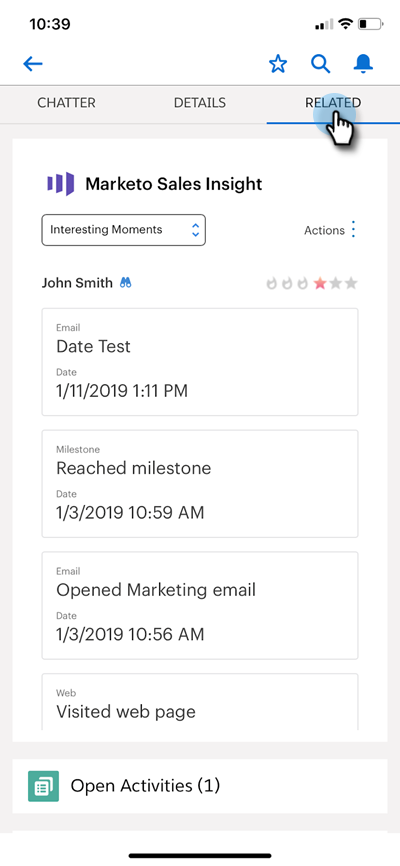

# Salesforce1の興味深い瞬間{#interesting-moments-in-salesforce}

[興味深い](/help/marketo/product-docs/marketo-sales-insight/msi-for-salesforce/features/tabs-in-the-msi-panel/interesting-moments/using-interesting-moments.md) お問い合わせの使用は、Marketo Sales Insightアプリを通じてセールスチームと連絡を取るための鍵となります。Marketo Sales Insight for Salesforce1では、スマートフォンでも同じことができます。

>[!AVAILABILITY]
>
>これらは、Marketor Sales Insightのお客様のみ利用できます。

1. スマートフォンで、Salesforceアプリを開きます。

1. リードにナビゲートします。

   

1. 「**関連**」タブをクリックして、注目の場面、Webアクティビティ、電子メール、スコアを表示します。

   

>[!MORELIKETHIS]
>
>* [面白い瞬間](/help/marketo/product-docs/core-marketo-concepts/smart-campaigns/flow-actions/interesting-moment.md)
>* [興味深い瞬間のトークン](/help/marketo/product-docs/marketo-sales-insight/msi-for-salesforce/features/tabs-in-the-msi-panel/interesting-moments/tokens-for-interesting-moments.md)

