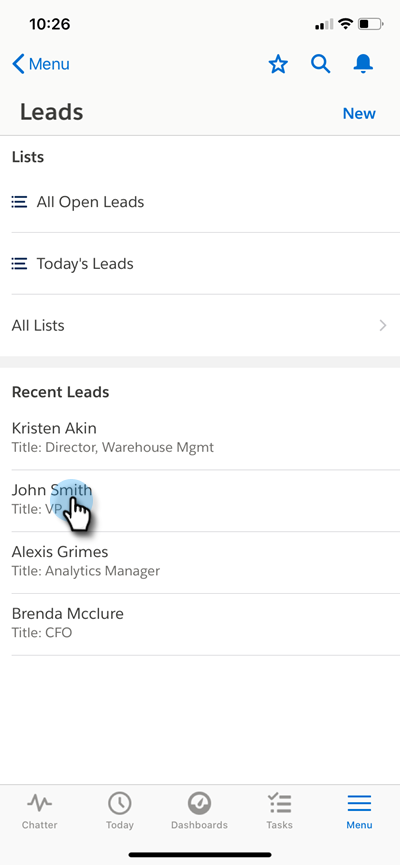

# Salesforce1 での注目のアクション {#interesting-moments-in-salesforce}

[注目のアクションを使用](/help/marketo/product-docs/marketo-sales-insight/msi-for-salesforce/features/tabs-in-the-msi-panel/interesting-moments/using-interesting-moments.md)することは、Marketo Sales Insight アプリを通じてセールスチームとコミュニケーションを取るための鍵となります。Marketo Sales Insight for Salesforce1 の登場で、同じことをスマートフォン上でもできるようになりました。

>[!AVAILABILITY]
>
>これを使用できるのは、Marketo Sales Insight を契約しているお客様だけです。

1. スマートフォンで、Salesforce アプリを開きます。

1. リードに移動します。

   

1. 「**関連**」タブをクリックして、注目のアクション、Web アクティビティ、メール、スコアを表示します。

   

>[!MORELIKETHIS]
>
>* [注目のアクション](/help/marketo/product-docs/core-marketo-concepts/smart-campaigns/flow-actions/interesting-moment.md)
>* [注目のアクションのトークン](/help/marketo/product-docs/marketo-sales-insight/msi-for-salesforce/features/tabs-in-the-msi-panel/interesting-moments/trigger-tokens-for-interesting-moments.md)

