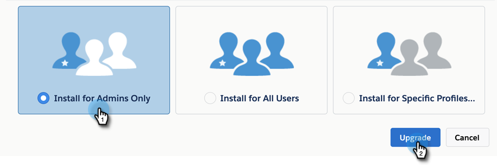

# MSI パッケージのアップグレード {#upgrading-your-msi-package}

>[!IMPORTANT]
>
>Salesforce によるセキュリティ強化により、セールスインサイトパッケージでは標準オブジェクトへの権限を付与できなくなりました。 今後、セールスインサイトユーザの Salesforce プロファイルには、リード、取引先責任者、アカウント、商談などの標準オブジェクトに対する読み取りアクセス権が必要になります。 [その設定方法について詳しくは、こちらを参照してください](/help/marketo/product-docs/marketo-sales-insight/msi-for-salesforce/configuration/configure-marketo-sales-insight-in-salesforce-professional-edition.md#grant-sales-insight-users-profile-access){target="_blank"}。

1. [appexchange のこのページ](https://appexchange.salesforce.com/listingDetail?listingId=a0N30000001SVZmEAO){target="_blank"}に移動します。

1. 手順 1 のページの右上隅にある [!DNL Salesforce] インスタンス（Marketo インスタンスに接続されているものは、サンドボックスまたは本番稼働）にログインします。 [!DNL Salesforce] で管理パッケージをインストール／アップグレードするには、管理者権限が必要です。

1. 「**すぐに入手**」ボタンをクリックします。 インストール先を選択するよう求められます。 以前のバージョンの MSI が既に存在するので、アップグレードするオプションが与えられます。 手順 1 でログインしたアカウントに基づいて、オプションを選択します。

   >[!TIP]
   >
   >本番稼働インスタンスをアップグレードする前に、サンドボックスインスタンスでこれをテストすることをお勧めします。

1. 「管理者専用にインストール」（および後で特定のプロファイルに MSI アクセスを提供）、「すべてのユーザ用にインストール」、「特定のプロファイル用にインストール」のいずれかを選択してパッケージをアップグレードできます。 この例では、「管理者専用」を選択しています。 選択が完了したら、「**アップグレード**」をクリックします。

   

>[!NOTE]
>
>管理者のみに対してパッケージを更新し、購入した MSI シート数に基づいて[特定のユーザーにアクセスを提供](/help/marketo/product-docs/marketo-sales-insight/msi-for-salesforce/configuration/add-sales-insight-access-to-profiles.md){target="_blank"}することをお勧めします。 または、MSI ユーザー用の特定の Salesforce プロファイルを作成し、そのユーザー用のパッケージのみをインストールまたはアップグレードすることもできます。
