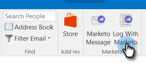
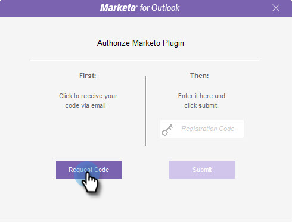
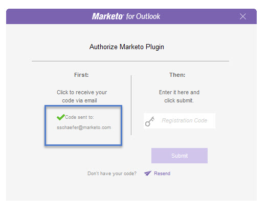
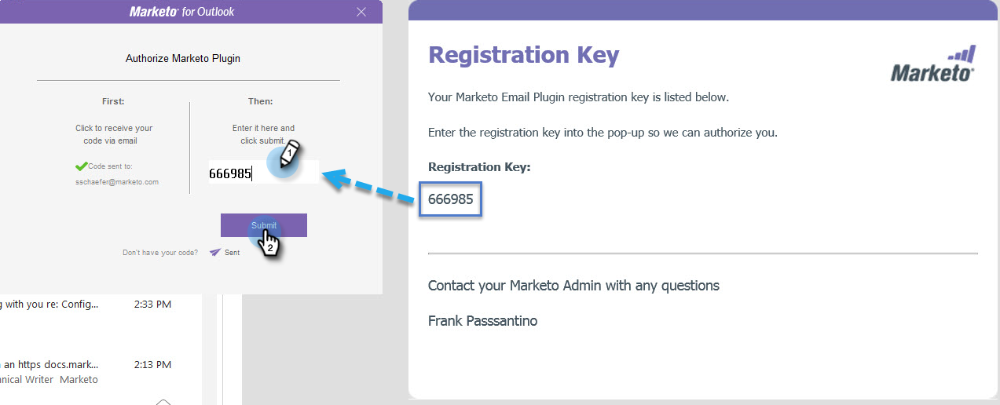
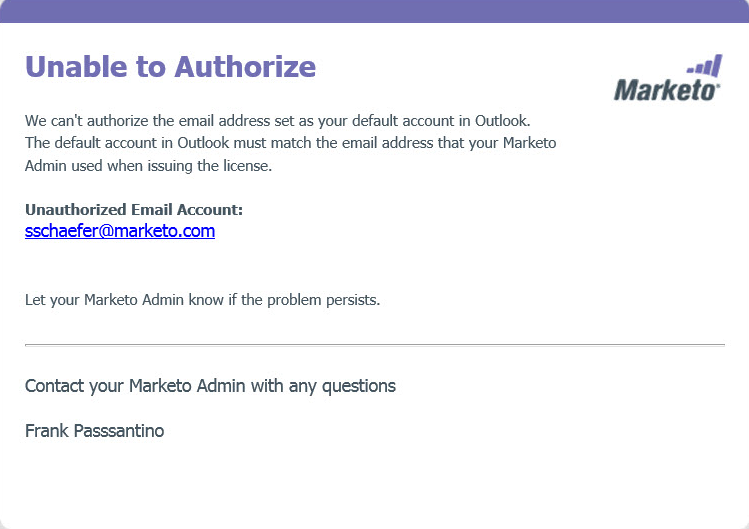

# Marketo [!DNL Outlook] プラグインの認証 {#authorize-the-marketo-outlook-plugin}

[!DNL Outlook] で Marketo MSI プラグインを使用するには、認証する必要があります。

>[!PREREQUISITES]
>
>プラグインが既にインストールされており、Marketo 管理者によってプラグインユーザーとして承認されている必要があります。

>[!IMPORTANT]
>
>Microsoft は、[Outlook for Windows の新しいバージョン &#x200B;](https://techcommunity.microsoft.com/t5/outlook-blog/new-outlook-for-windows-now-available/ba-p/3932068){target="_blank"}をリリースしました。 この新しいバージョンは、既存の MSI Outlook プラグインをサポートしていません。 MSI Outlook プラグインは、Outlook のクラシックバージョンを実行している Windows デスクトップで引き続き機能します。 組織向けの新しい Outlook for Windows の詳細については、[こちらをクリック](https://techcommunity.microsoft.com/t5/outlook-blog/the-new-outlook-for-windows-for-organization-admins/ba-p/3929169){target="_blank"}してください。

1. 「Marketo メッセージ」ボタンのいずれかをクリックします。

   

1. [!UICONTROL Marketo プラグインを認証]ダイアログが表示されたら、「**[!UICONTROL リクエストコード]**」をクリックします。

   

1. コードは、デフォルトの [!DNL Outlook] アカウントのメールアドレスに送信されます。

   

1. デフォルトの [!DNL Outlook] アカウントのメールアドレスがチェックアウトされると、登録キーが送信されます。 ポップアップに入力し、「**[!UICONTROL 送信]**」をクリックします。

   

   >[!NOTE]
   >
   >登録コードは **14 日後に有効期限が切れます**。

1. メールアドレスが承認されていない場合は、次のようなあまりうれしくないメールが届きます。 この問題を解決するには、Marketo 管理者にお問い合わせください。

   
