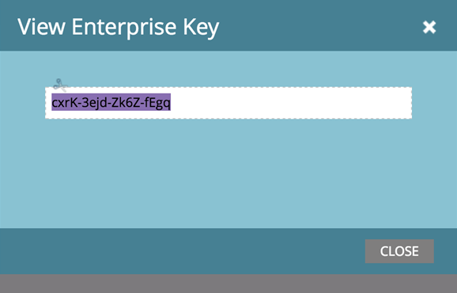

# エンタープライズキーを使用したOutlook用Marketing 追加-inのインストール {#install-the-marketo-add-in-for-outlook-with-an-enterprise-key}

セールス担当者は、ノートパソコンに対する管理者権限を持たないことが多く、ITチームは、すべてのソフトウェアをリモートでインストールする必要があります。 Outlook用のMarketing-追加inは、この方法でEnterprise Keyを使用してインストールできます。Enterprise Keyは、管理者の「Sales Insight」セクションにあります。

>[!NOTE]
>
>**前提条件**
>
>管理者は、Marketor Email 追加 In Licenseを [発行している必要があります](issue-a-marketo-email-add-in-license.md)。

>[!NOTE]
>
>表示の[エンタープライズキー]ボタンが表示されない場合は、に問い合わせ [`[email protected]`](http://docs.marketo.com/cdn-cgi/l/email-protection#1c6f696c6c736e685c717d6e77796873327f7371) て有効にしてください。

1. 「マーケティング」で、「 **管理者」**&#x200B;をクリックし、「Sales Insight **」をクリックします。**

   

1. 「 **Email追加-In** 」タブをクリックします。

   

1. 「 **表示エンタープライズキー**」をクリックします。

   

1. Outlook Enterpriseライセンスキーをコピーして、このリンクと共に電子メールに貼り付け [、IT部門に送信してリモートインストールを行います](marketo-outlook-plugin-installation-by-it.md)。

   

   それだけだ！ 次に、営業担当者は [登録プロセスを経る](authorize-the-marketo-outlook-plugin.md)。 手順へのリンクをユーザーに送信できます( **Marketor関連記事**)。

   >[!NOTE]
   >
   >**関連記事**
   >
   >    
   >    
   >    * [Marketto Outlookプラグインを認証する](authorize-the-marketo-outlook-plugin.md)

