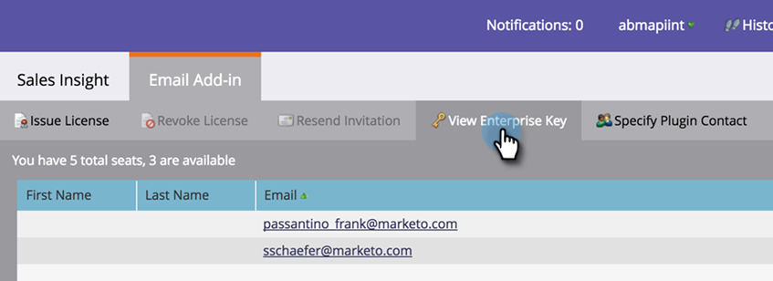
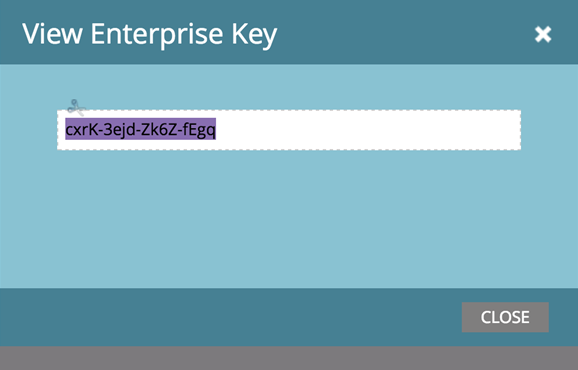

# エンタープライズキーを使用した [!DNL Outlook] 用 Marketo アドインのインストール {#install-the-marketo-add-in-for-outlook-with-an-enterprise-key}

多くの場合、セールス担当者は自分のノート PC で管理者権限を持っておらず、IT チームがすべてのソフトウェアをリモートでインストールする責任を負います。Outlook 用 Marketo アドインは、この方法でエンタープライズキーを使用してインストールできます。エンタープライズキーは、管理者のセールスインサイトセクションにあります。「エンタープライズキーを表示」ボタンが表示されない場合は、[Marketo サポート](https://nation.marketo.com/t5/Support/ct-p/Support)に問い合わせて有効にします。

>[!PREREQUISITES]
>
>管理者が [Marketo メールアドインライセンスを発行](/help/marketo/product-docs/marketo-sales-insight/msi-outlook-plugin/issue-a-marketo-email-add-in-license.md)している必要があります。

>[!NOTE]
>
>セールスインサイトアクションの機能（セールスメールを送信、セールスキャンペーンに追加、タスクなど）は、Gmail および Outlook 用のセールスインサイトメールプラグインでは使用できません。現時点では、ユーザは、セールスインサイトメールプラグインを使用している場合に、Marketo メールテンプレートを使用した／していないトラッキング可能なメールをお使いのメールクライアントから送信する機能のみ使用できます。

>[!IMPORTANT]
>
>Microsoft は、[Outlook for Windows の新しいバージョン &#x200B;](https://techcommunity.microsoft.com/t5/outlook-blog/new-outlook-for-windows-now-available/ba-p/3932068){target="_blank"}をリリースしました。この新しいバージョンは、既存の MSI Outlook プラグインをサポートしていません。MSI Outlook プラグインは、Outlook のクラシックバージョンを実行している Windows デスクトップで引き続き機能します。組織向けの新しい Outlook for Windows の詳細については、[こちらをクリック](https://techcommunity.microsoft.com/t5/outlook-blog/the-new-outlook-for-windows-for-organization-admins/ba-p/3929169){target="_blank"}してください。

1. My Marketo で、「**[!UICONTROL 管理者]**」をクリックし、「**[!UICONTROL セールスインサイト]**」をクリックします。

   

1. 「**[!UICONTROL メールアドイン]**」タブをクリックします。

   

1. 「**[!UICONTROL エンタープライズキーを表示]**」をクリックします。

   

1. [このリンク](/help/marketo/product-docs/marketo-sales-insight/msi-outlook-plugin/marketo-outlook-plugin-installation-by-it.md)と [!DNL Outlook Enterprise] ライセンスキーをコピーし、メールに貼り付け、リモートインストール用に IT 部門に送信します。

   

   それだけです。次に、セールス担当者が[登録](/help/marketo/product-docs/marketo-sales-insight/msi-outlook-plugin/authorize-the-marketo-outlook-plugin.md)を処理します。
