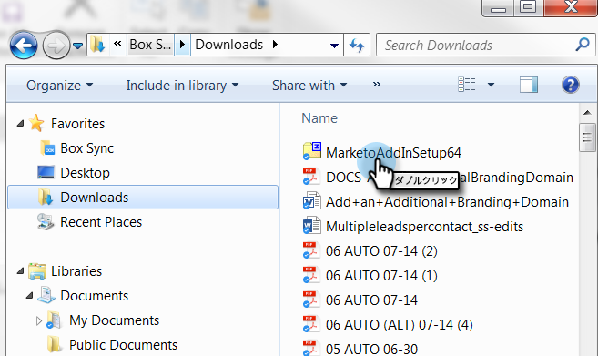

# 登録コードを使用したOutlook用Marketo Eメールイン追加のインストール {#install-the-marketo-email-add-in-for-outlook-with-a-registration-code}

ユーザーがラップトップの管理設定にアクセスできる場合は、ユーザーに登録コードを直接送信できます。

招待用の電子メールを受け取っていない場合は、マーケティング担当者に招待を依頼してください。

>[!NOTE]
>
>**前提条件**
>
>* Marketor Email 追加-inライセンスが [発行される必要があります](issue-a-marketo-email-add-in-license.md)。

>

## インストーラーのダウンロード {#download-installer}

1. ご使用の [Microsoft Outlookバージョンの確認](http://support.office.com/en-us/article/what-version-of-outlook-do-i-have-b3a9568c-edb5-42b9-9825-d48d82b2257c)
1. リンクをクリックして、お使いのバージョンのMicrosoft Outlookに適したインストーラをダウンロードします。

   >[!NOTE]
   >
   >以下のリンクは、現在Chromeでのみ機能します。 ご不便をおかけして申し訳ございません。

   | Outlookバージョン | 32ビットOutlook | 64ビットOutlook |
   |---|---|---|
   | Outlook 2000 | 非対応 | 該当なし |
   | Outlook 2003 | [ダウンロード](http://munchkin.marketo.net/MarketoAddInSetup32.msi) | 該当なし |
   | Outlook 2007 | [ダウンロード](http://munchkin.marketo.net/MarketoAddInSetup32.msi) | 該当なし |
   | Outlook 2010 | [ダウンロード](http://munchkin.marketo.net/MarketoAddInSetup32.msi) | [ダウンロード](http://munchkin.marketo.net/MarketoAddInSetup64.msi) |
   | Outlook 2013 | [ダウンロード](http://munchkin.marketo.net/MarketoAddInSetup32.msi) | [ダウンロード](http://munchkin.marketo.net/MarketoAddInSetup64.msi) |
   | Outlook 2016 | [ダウンロード](http://munchkin.marketo.net/MarketoAddInSetup32.msi) | [ダウンロード](http://munchkin.marketo.net/MarketoAddInSetup64.msi) |
   | Outlook 2019 | [ダウンロード](http://munchkin.marketo.net/MarketoAddInSetup32.msi) | [ダウンロード](http://munchkin.marketo.net/MarketoAddInSetup64.msi) |
   | Outlook O365 （Windowsのみ） | [ダウンロード](http://munchkin.marketo.net/MarketoAddInSetup32.msi) | [ダウンロード](http://munchkin.marketo.net/MarketoAddInSetup64.msi) |
   | Outlook for Mac | 非対応 | 非対応 |
   | Outlook Web App | 非対応 | 非対応 |

## 登録コードのコピー {#copy-your-registration-code}

1. 受け取った招待用電子メールから登録コードをコピーします。

   

1. Microsoft Outlookを閉じます。

   

## インストール {#install}

1. インストーラーを実行します。

   

   >[!NOTE]
   >
   >警告が出たら心配するな！ 「 **実行**」をクリックするだけです。

1. 「 **次へ**」をクリックします。

   

1. 「 **名**」、「 **姓**」、「電子メールアドレス」に入力し、**登録コード ****をコピーして電子メールに貼り付けます。次へをクリックし******&#x200B;ます。

   

   >[!TIP]
   >
   >インストールに失敗した場合は、IT部門に問い合わせて、HTTPSトラフィックがブロックされていないことを確認してください。 インストーラーでHTTPSトラフィックが開いている必要があります。

1. 「**次へ**」をクリックして、デフォルトの場所にインストールします。

   

1. 「 **次へ**」をクリックします。

   

   >[!NOTE]
   >
   >不明な発行者に関するセキュリティプロンプトが表示された場合は、 **「はい**」をクリックします。

1. これでインストールが完了し、「 **閉じる**」をクリックします。

   

1. 次に、Microsoft Outlookを開き、「Marketo」ボタンを表示します。

   

   素晴らしい！ これで、「マーケティング」ボタンの位置が改善されました。

「Marketor Message」アクションと「Log With Marketo」アクションの使用について詳しく説明します。

>[!NOTE]
>
>**関連記事**
>
>* [Outlook用のMarketing Eメールインを使用した電子メールの送信と追跡](send-and-track-an-email-with-the-email-add-in-for-outlook.md)
>* [Marketorテンプレートを使用したOutlookからの送信と追跡](send-and-track-from-outlook-using-a-marketo-template.md)

>

