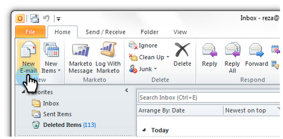
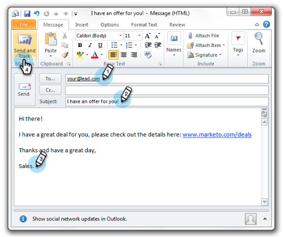
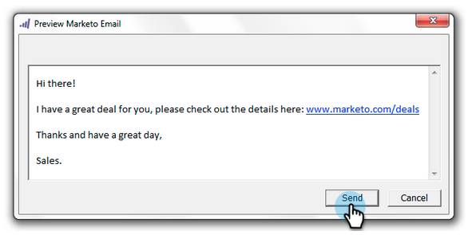
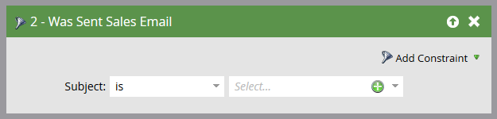

# [!DNL Outlook] 用メールアドインを使用したメールの送信とトラッキング {#send-and-track-an-email-with-the-email-add-in-for-outlook}

[!DNL Outlook] から直接、Marketo のメールを送信して、トラッキングできます。

>[!PREREQUISITES]
>
>まだインストールしていない場合は、[&#x200B; [!DNL Outlook]](/help/marketo/product-docs/marketo-sales-insight/msi-outlook-plugin/install-the-marketo-email-add-in-for-outlook-with-a-registration-code.md) 用 Marketo メールアドインをインストールします。

>[!NOTE]
>
>セールスインサイトアクションの機能（セールスメールを送信、セールスキャンペーンに追加、タスクなど）は、Gmail および Outlook 用のセールスインサイトメールプラグインでは使用できません。現時点では、ユーザは、セールスインサイトメールプラグインを使用している場合に、Marketo メールテンプレートを使用した／していないトラッキング可能なメールをお使いのメールクライアントから送信する機能のみ使用できます。

1. Microsoft Outlook を開き、新しいメールを作成します。

   

   >[!CAUTION]
   >
   >メールに複数の受信者を指定した場合は、最初の受信者のもとですべてのアクティビティがトラッキングされます。

1. 通常どおりにメールを作成し、「**[!UICONTROL 送信してトラッキング]**」をクリックします。

   

   >[!NOTE]
   >
   >Marketo インスタンスに存在しない人にメールを送信すると、その人のリードレコードが自動的に作成されます。その場合の姓は必ず「mktUnknown」となるので、すぐに区別がつきます。

   >[!TIP]
   >
   >Marketo テンプレートを使用する場合は、[テンプレートを使用した  [!DNL Outlook]  からの送信とトラッキング](/help/marketo/product-docs/marketo-sales-insight/msi-outlook-plugin/send-and-track-from-outlook-using-a-marketo-template.md)を参照してください。

1. 最後にプレビューを確認してから、「**[!UICONTROL 送信]**」をクリックします。

   

   >[!CAUTION]
   >
   >スパム対策テクノロジーは、多くの場合、メール送信後 20 秒以内に発生した開封数およびクリック数を拒否するので、テスト中には少なくとも 20 秒経ってから開封またはクリックしてください。

   [!DNL Outlook] を通じて送信されたメールの受信者を確認するには、「[!UICONTROL 送信済みセールスメール]」フィルターを使用してスマートリストを作成します。

   

簡単です。このメールはセールスチームの [!DNL Outlook] から送信されますが、トラッキングは Marketo で行われます。

>[!MORELIKETHIS]
>
>[リードから着信したメールを Marketo でログに記録](/help/marketo/product-docs/marketo-sales-insight/using-msi/log-inbound-mail-from-your-leads-in-marketo.md)
