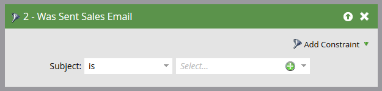

# Outlook 用メールアドインを使用したメールの送信とトラック {#send-and-track-an-email-with-the-email-add-in-for-outlook}

Outlook から直接、Marketo のメールを送信し、トラックすることが可能です。

>[!PREREQUISITES]
>
>まだインストールしていない場合は、[Outlook 用 Marketo メールアドイン](/help/marketo/product-docs/marketo-sales-insight/msi-outlook-plugin/install-the-marketo-email-add-in-for-outlook-with-a-registration-code.md)をインストールします。

1. Microsoft Outlook を開き、新しいメールを作成します。

   

   >[!CAUTION]
   >
   >メールに複数の受信者を指定した場合は、最初の受信者のもとですべてのアクティビティがトラックされます。

1. 通常どおりにメールを作成し、「**送信してトラック**」をクリックします。

   

   >[!NOTE]
   >
   >Marketo インスタンスに存在しない人にメールを送信すると、その人のリードレコードが自動的に作成されます。その場合の姓は必ず「mktUnknown」となるので、すぐに区別がつきます。

   >[!TIP]
   >
   >Marketo テンプレートを使用する場合は、[テンプレートを使用した Outlook からの送信、追跡](/help/marketo/product-docs/marketo-sales-insight/msi-outlook-plugin/send-and-track-from-outlook-using-a-marketo-template.md)を参照してください。

1. 最後にプレビューを確認してから、「**送信**」をクリックします。

   

   >[!CAUTION]
   >
   >スパム対策テクノロジーは、多くの場合、メール送信後 20 秒以内に発生した開封数およびクリック数を拒否するので、テスト中には少なくとも 20 秒経ってから開封またはクリックしてください。

   Outlook を通じて送信されたメールの受信者を確認するには、「送信済みセールスメール」フィルターを使用してスマートリストを作成します。

   

簡単ですね。このメールはセールスチームの Outlook から送信されますが、トラックは Marketo で行われます。

>[!MORELIKETHIS]
>
>[リードから着信したメールを Marketo でログに記録](/help/marketo/product-docs/marketo-sales-insight/using-msi/log-inbound-mail-from-your-leads-in-marketo.md)
