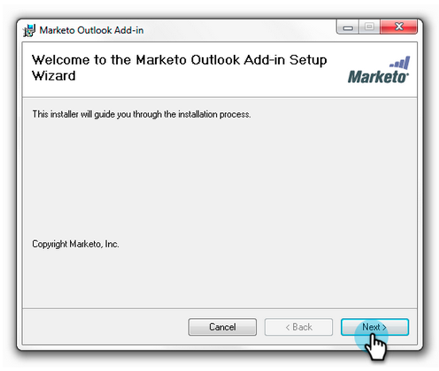
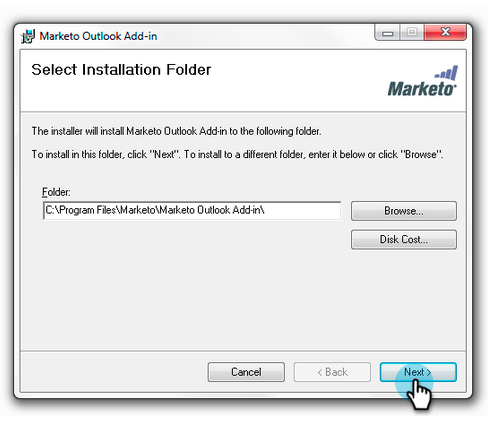

# [!DNL Outlook] 用Marketo E メール アドインのアップグレード {#upgrade-your-marketo-email-add-in-for-outlook}

[!DNL Outlook] 用のMarketo E メールアドインの新しいバージョンが利用可能な場合は、次の手順に従ってアップグレードしてください。

>[!NOTE]
>
>2020 年 10 月 1 日（PT）をもって、最新バージョンの [!DNL Outlook] プラグインはオフラインモードをサポートしなくなりました。 これは、10 月 1 日以降にインストール／アップグレードした後に有効になります。

## インストーラーのダウンロード {#download-installer}

お使いのバージョンのMicrosoft [!DNL Outlook] に適したインストーラーをダウンロードします。

<table>
 <colgroup>
  <col>
  <col>
  <col>
  <col>
  <col>
 </colgroup>
 <tbody>
  <tr>
   <th> </th>
   <th colspan="2">シングルユーザー招待によるインストール</th>
   <th colspan="2">エンタープライズキーによるインストール</th>
  </tr>
  <tr>
   <td><strong>Outlook バージョン</strong></td>
   <td><strong>32 ビット</strong></td>
   <td><strong>64 ビット</strong></td>
   <td><strong>32 ビット</strong></td>
   <td><strong>64 ビット</strong></td>
  </tr>
  <tr>
   <td>Outlook 2000</td>
   <td>サポート対象外</td>
   <td>なし</td>
   <td>サポート対象外</td>
   <td>なし</td>
  </tr>
  <tr>
   <td>Outlook 2003</td>
   <td><a href="https://munchkin.marketo.net/MarketoAddInSetup32.msi" rel="nofollow">ダウンロード</a></td>
   <td>なし</td>
   <td>サポート対象外</td>
   <td>なし</td>
  </tr>
  <tr>
   <td>Outlook 2007</td>
   <td><a href="https://munchkin.marketo.net/MarketoAddInSetup32.msi" rel="nofollow">ダウンロード</a></td>
   <td>なし</td>
   <td>サポート対象外</td>
   <td>なし</td>
  </tr>
  <tr>
   <td>Outlook 2010</td>
   <td><a href="https://munchkin.marketo.net/MarketoAddInSetup32.msi" rel="nofollow">ダウンロード</a></td>
   <td><a href="https://munchkin.marketo.net/MarketoAddInSetup64.msi" rel="nofollow">ダウンロード</a></td>
   <td><a href="https://munchkin.marketo.net/MarketoAddInSetup32.msi" rel="nofollow">ダウンロード</a></td>
   <td><a href="https://munchkin.marketo.net/MarketoAddInSetup64.msi" rel="nofollow">ダウンロード</a></td>
  </tr>
  <tr>
   <td> 見通し  2013</td>
   <td><a href="https://munchkin.marketo.net/MarketoAddInSetup32.msi" rel="nofollow">ダウンロード</a></td>
   <td><a href="https://munchkin.marketo.net/MarketoAddInSetup64.msi" rel="nofollow">ダウンロード</a></td>
   <td><a href="https://munchkin.marketo.net/MarketoAddInSetup32.msi" rel="nofollow">ダウンロード</a></td>
   <td><a href="https://munchkin.marketo.net/MarketoAddInSetup64.msi" rel="nofollow">ダウンロード</a></td>
  </tr>
  <tr>
   <td>Outlook 2016</td>
   <td><a href="https://munchkin.marketo.net/MarketoAddInSetup32.msi" rel="nofollow">ダウンロード</a></td>
   <td><a href="https://munchkin.marketo.net/MarketoAddInSetup64.msi" rel="nofollow">ダウンロード</a></td>
   <td><a href="https://munchkin.marketo.net/MarketoAddInSetup32.msi" rel="nofollow">ダウンロード</a></td>
   <td><a href="https://munchkin.marketo.net/MarketoAddInSetup64.msi" rel="nofollow">ダウンロード</a></td>
  </tr>
  <tr>
   <td colspan="1">Outlook 2019 年</td>
   <td colspan="1"><a href="https://munchkin.marketo.net/MarketoAddInSetup32.msi" rel="nofollow">ダウンロード</a></td>
   <td colspan="1"><a href="https://munchkin.marketo.net/MarketoAddInSetup64.msi" rel="nofollow">ダウンロード</a></td>
   <td colspan="1"><a href="https://munchkin.marketo.net/MarketoAddInSetup32.msi" rel="nofollow">ダウンロード</a></td>
   <td colspan="1"><a href="https://munchkin.marketo.net/MarketoAddInSetup64.msi" rel="nofollow">ダウンロード</a></td>
  </tr>
  <tr>
   <td>Macの Outlook</td>
   <td>サポート対象外</td>
   <td>サポート対象外</td>
   <td>サポート対象外</td>
   <td>サポート対象外</td>
  </tr>
  <tr>
   <td colspan="1">Outlook Web App</td>
   <td colspan="1">サポート対象外</td>
   <td colspan="1">サポート対象外</td>
   <td colspan="1">サポート対象外</td>
   <td colspan="1">サポート対象外</td>
  </tr>
  <tr>
   <td colspan="1">Office 365*</td>
   <td colspan="1"><a href="https://munchkin.marketo.net/MarketoAddInSetup32.msi" rel="nofollow">ダウンロード</a></td>
   <td colspan="1"><a href="https://munchkin.marketo.net/MarketoAddInSetup64.msi" rel="nofollow">ダウンロード</a></td>
   <td colspan="1"><a href="https://munchkin.marketo.net/MarketoAddInSetup32.msi" rel="nofollow">ダウンロード</a></td>
   <td colspan="1"><a href="https://munchkin.marketo.net/MarketoAddInSetup64.msi" rel="nofollow">ダウンロード</a></td>
  </tr>
 </tbody>
</table>

&#42;Office 365 バージョン：Windows クライアントのみ（Windows 10、Windows 11、Enterprise または Pro）。

## アップグレード {#upgrade}

1. [[!DNL Microsoft Outlook]  バージョン ](https://support.microsoft.com/ja-jp/office/what-version-of-outlook-do-i-have-b3a9568c-edb5-42b9-9825-d48d82b2257c?ui=en-us&rs=en-us&ad=us) を特定します。

1. 上のリストからお使いのバージョンを選択します。

1. インストーラーを実行します。

   

1. 「**[!UICONTROL 次へ]**」をクリックします。

   

   >[!NOTE]
   >
   >場合によっては、データが不足していることがあります。登録メールからコピーし、[!DNL Outlook] を閉じます。

1. [!DNL Microsoft Outlook] を閉じます。

   

1. 情報はすべて事前入力されています。**[!UICONTROL 次へ]**&#x200B;をクリックします。

   

   >[!TIP]
   >
   >インストールに失敗した場合は、IT 担当者と相談し、HTTPS トラフィックがブロックされていないかどうか確認してください。インストーラーを実行するには HTTPS トラフィックが必要です。

1. 「**[!UICONTROL 次へ]**」をクリックして、デフォルトの場所にインストールします。

   

1. 「**[!UICONTROL 次へ]**」をクリックします。

   

1. インストールが完了しました。「**[!UICONTROL 閉じる]**」をクリックします。

   

1. 次に [!UICONTROL Microsoft Outlook] を開いて、Marketo ボタンの最新バージョンを確認してください。

   

>[!MORELIKETHIS]
>
>* [Marketo Email Add-in for [!UICONTROL Outlook を使用したメールの送信とトラッキング &#x200B;]](/help/marketo/product-docs/marketo-sales-insight/msi-outlook-plugin/send-and-track-an-email-with-the-email-add-in-for-outlook.md)
>* [Marketo テンプレートを使用した [!UICONTROL Outlook] からの送信とトラッキング ](/help/marketo/product-docs/marketo-sales-insight/msi-outlook-plugin/send-and-track-from-outlook-using-a-marketo-template.md)
