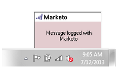

# リードから着信したメールを Marketo でログに記録する {#log-inbound-mail-from-your-leads-in-marketo}

[!DNL Outlook] では、Marketo メールアドインを使用して、リードからの返信をログに記録できます。

## メインの [!DNL Outlook] アプリケーションから {#from-the-main-outlook-application}

1. ログに記録するメールを選択し、「**[!UICONTROL Marketo でログを記録]**」をクリックします。

>[!TIP]
>
>メッセージを右クリックし、「**[!UICONTROL Marketo でログ]**」をクリックします。

確認メッセージが表示されます。

## メール自体から {#from-the-email-itself}

メールを開いている場合は、そこから「**[!UICONTROL Marketo でログ]**」ボタンをクリックするだけです。

あと 1 つの方法と同じ確認が表示されます。

リードの返信をログに記録し、Marketo での履歴に追加します。

>[!MORELIKETHIS]
>
>* [&#x200B; [!DNL Outlook]](/help/marketo/product-docs/marketo-sales-insight/msi-outlook-plugin/send-and-track-an-email-with-the-email-add-in-for-outlook.md) 用 Marketo メールアドインを使用したメールの送信とトラック
>* [Marketo テンプレートを使用した  [!DNL Outlook]  からの送信とトラック](/help/marketo/product-docs/marketo-sales-insight/msi-outlook-plugin/send-and-track-from-outlook-using-a-marketo-template.md)
