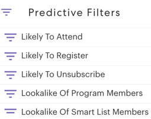
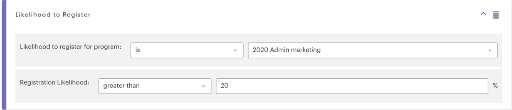
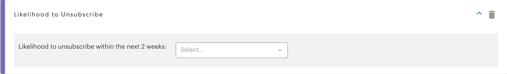
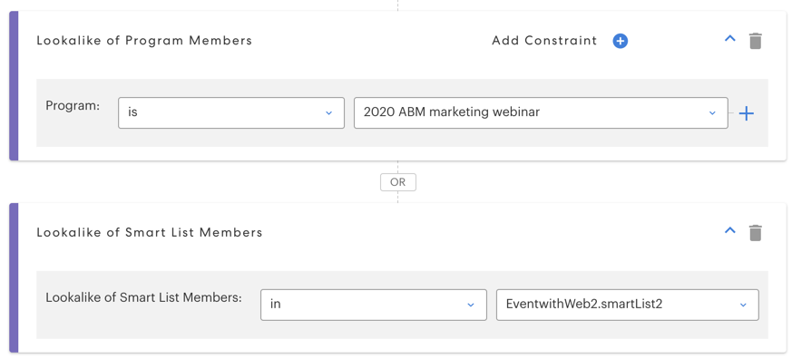

# 予測フィルター {#predictive-filters}

Marketoは、Predictive Audiences の一部として、スマートリストに AI/ML ベースのフィルターのグループを提供します。

>[!NOTE]
>
>「出席の可能性が高い」および「登録の可能性が高い」フィルターは、イベントまたはメールプログラムでのみ使用できます。 「配信停止の可能性」、「プログラムメンバーの類似」、「スマートリストメンバーの類似」は、すべてのプログラムタイプで使用できます。

## 出席の可能性

このフィルターは、オーディエンスを効果的に絞り込むために使用します。 これにより、より高い可能性を持つリードをターゲティングして招待できます **出席** オンラインセミナまたはイベント なお、「プログラムに参加する可能性」は、現在のイベントプログラムになります。

## 登録の可能性

次に類似 _出席の可能性_ フィルターを適用し、このフィルターを使用してオーディエンスを絞り込み、より高い可能性を持つリードをターゲット設定します **登録中** オンラインセミナーやイベントの

## 配信停止の可能性

これにより、次の 2 週間に購読解除される可能性が高いか低いかによってオーディエンスをフィルタリングします。 これを使用して、高疲労リードを異なる方法でより効果的にターゲット設定できます。 配信停止しきい値は、データベース内のリードタイムやリードアクティビティなど、複数の属性を考慮した AI モデルによって動的に決定されます。

>[!NOTE]
>
>参加/登録/購読解除の可能性フィルターは、他の標準フィルターと組み合わせて使用する必要があります。

## プログラムメンバーの類似/スマートリストメンバーの類似

これら 2 つのフィルターは、別のプログラムまたはスマートリストのメンバーに類似した追加のリードをターゲットにすることで、現在のオーディエンスを拡大するのに役立ちます。 類似フィルターは、リード属性、電子メールアクティビティ、Web アクティビティ、エンゲージメントを含む 50 以上の要因を考慮します。

クリック **[!UICONTROL 制約を追加]** 選択したプログラムのメンバーの達成基準を選択します。

複数のプログラム/スマートリストを 1 つのフィルターに簡単に追加するには、プログラムドロップダウンの横にある+アイコンをクリックします。

