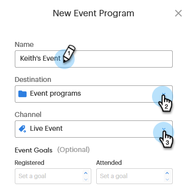

# イベント目標の設定 {#setting-event-goals}

イベントに具体的な目標を設定し、その効果を確認します。

>[!IMPORTANT]
>
>この機能を購入したユーザーはいません。 詳しくは、Adobeアカウントチーム（担当のアカウントマネージャー）にお問い合わせください。

1. イベントプログラムを作成します。

   

1. イベントに[!UICONTROL 名前]を付け、[!UICONTROL 宛先]フォルダーと[!UICONTROL チャネル]を選択します。

   

1. [!UICONTROL 登録]および[!UICONTROL 出席]の目標を入力し、「**[!UICONTROL 作成]**」をクリックします（[!UICONTROL 説明]および[!UICONTROL ラベル]はオプションです）。

   

これで完了です。イベントの目標ステータスを確認するには、「[!UICONTROL レポート]」タブをクリックします。
