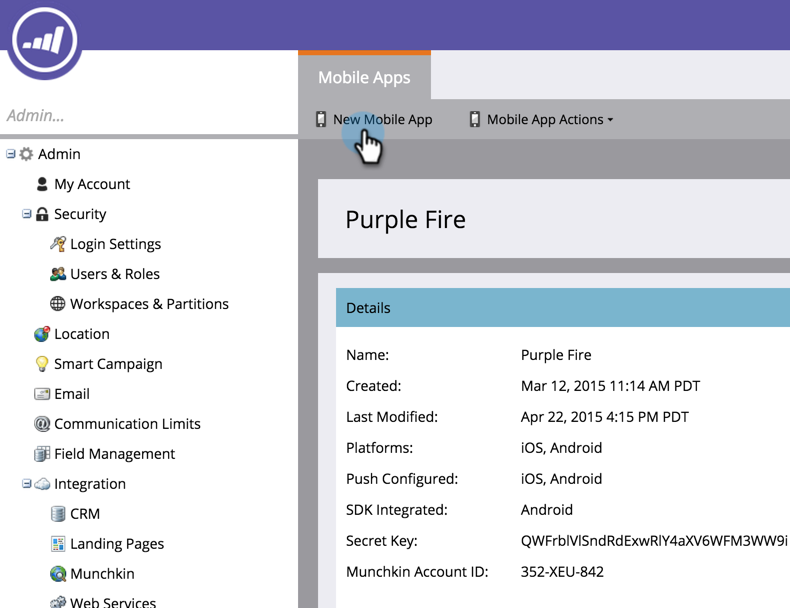

# 追加モバイルアプリ{#add-a-mobile-app}

モバイルアプリとMarketoを接続して、プッシュ通知を顧客ベースに送信します。

アプリは通常、サンドボックス環境に開始アウトします。ここでは、初回の開発とテストが実行されます。 その後、開発者は実稼働環境を使用して、お客様が使用する最終的なアプリを作成します。 モバイルアプリを追加する場合は、適切な通知証明書を選択する必要があります（次の手順4を参照）。

>[!AVAILABILITY]
>
>
>この機能を購入していないお客様もいます。 詳細については、セールス担当者にお問い合わせください。

1. 「**管理者**」をクリックします。

   

1. 「**モバイルアプリ&amp;デバイス**」をクリックします。

   

   「新規モバイルアプリ」をクリックします。

   

1. 名前を入力します。 「**タイプ**」ドロップダウンで、使用している環境のタイプ（「Sandbox」または「実稼働」）を選択します。 「**保存**」をクリックします。

   

   >[!NOTE]
   >
   >実稼働環境では、実稼働用通知証明書を使用することをお勧めします。 サンドボックス証明書は、問題なく実稼働環境にインストールされますが、通知は受け取りません。 環境証明書や通知証明書についてご不明な点がある場合は、マーケティング担当者またはモバイルアプリの開発者にお問い合わせください。

   ナイス！ 次に、AndroidおよびiOSデバイスで動作するようにアプリを設定します。

>[!MORELIKETHIS]
>
>* [モバイルアプリのAndroidプッシュアクセスの設定](configure-mobile-app-android-push-access.md)
>* [モバイルアプリのiOSプッシュアクセスの設定](configure-mobile-app-ios-push-access.md)

>

