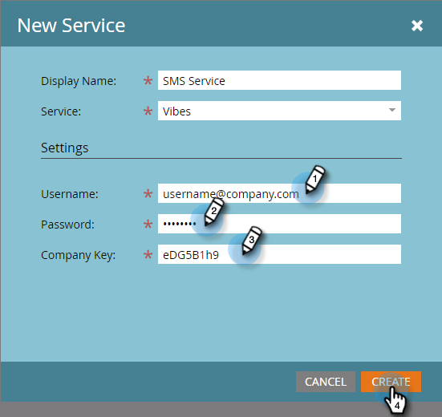

# Vibes を LaunchPoint サービスとして追加する {#add-vibes-as-a-launchpoint-service}

Vibes SMS キャンペーンにオプトインしたユーザーにSMS メッセージを送信するには、SMS アクティビティを活用して、Marketo Engage インスタンスでキャンペーンをトリガーおよびフィルタリングします。 まず、Vibes を LaunchPoint サービスとして追加する必要があります。

>[!NOTE]
>
>**管理者権限が必要**

>[!PREREQUISITES]
>
>Vibes SMSのアクティブなVibes アカウントとAdobe ライセンスが必要です。

1. マイMarketoで、**[!UICONTROL 管理者]** エリアに移動します。

   

1. **[!UICONTROL LaunchPoint]**.をクリックします。

   

1. 「**[!UICONTROL 新規]**」、「**[!UICONTROL 新規サービス]**」の順にクリックします。

   

1. 表示名を入力し、ドロップダウンで「**[!UICONTROL Vibes]**」を選択します。

   

1. 「設定」で、Vibes [!UICONTROL &#x200B; ユーザー名]、[!UICONTROL &#x200B; パスワード &#x200B;]、[!UICONTROL 会社キー] （すべてVibes アカウントで確認できます）を入力します。 「**[!UICONTROL 作成]**」をクリックします。

   

   新しいSMS サービスが[!UICONTROL &#x200B; インストール済みサービス &#x200B;] リストに表示されるようになりました。

   

>[!MORELIKETHIS]
>
>[Vibes ビデオのデモ &#x200B;](https://vimeo.com/215233767/1ed136adbc)
