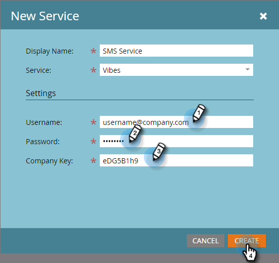

# Vibes を LaunchPoint サービスとして追加する {#add-vibes-as-a-launchpoint-service}

SMS アクティビティを活用して、Marketo Engageインスタンスでキャンペーンを詳細にトリガーおよびフィルタリングし、Vibes SMS キャンペーンにオプトインしたユーザーに SMS メッセージを送信できます。 まず、Vibes を LaunchPoint サービスとして追加する必要があります。

>[!NOTE]
>
>**管理者権限が必要**

>[!PREREQUISITES]
>
>アクティブな Vibes アカウントと、Vibes SMS のAdobeライセンスが必要です。

1. 「マイMarketo」で、「**[!UICONTROL 管理者]** エリアに移動します。

   

1. **[!UICONTROL LaunchPoint]**.をクリックします。

   

1. **[!UICONTROL 新規]**/**[!UICONTROL 新しいサービス]** をクリックします。

   

1. 表示名を入力し、ドロップダウンで「**[!UICONTROL Vibes]**」を選択します。

   

1. 設定で、Vibes [!UICONTROL  ユーザー名 ]、[!UICONTROL  パスワード ]、[!UICONTROL  会社キー ] を入力します（これらはすべて Vibes アカウントにあります）。 「**[!UICONTROL 作成]**」をクリックします。

   

   新しい SMS サービスが [!UICONTROL  インストールされたサービス ] リストに表示されます。

   

>[!MORELIKETHIS]
>
>[Vibes ビデオデモ ](https://vimeo.com/215233767/1ed136adbc)
