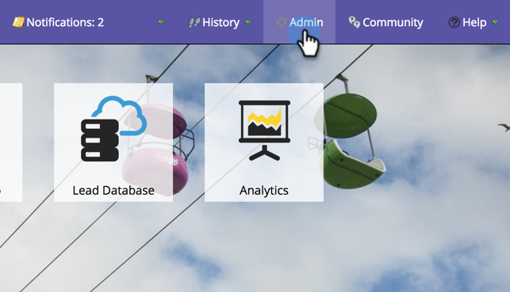

# モバイルアプリ Android プッシュアクセスの設定 {#configure-mobile-app-android-push-access}

1. 「**[!UICONTROL 管理者]**」をクリックします。

   

1. 「**[!UICONTROL モバイルアプリ]**」を選択します。

   

1. 目的のモバイルアプリを選択します。

   

1. 「**[!UICONTROL プッシュアクセスタイプ]**」で「**[!UICONTROL Android]**」を選択し、「**[!UICONTROL 設定]**」をクリックします。

   

   >[!NOTE]
   >
   >モバイルアプリデベロッパーから&#x200B;**[!UICONTROL サーバー API キー]**&#x200B;および&#x200B;**[!UICONTROL プロジェクト番号]**&#x200B;が必要です。 デベロッパーは、[!DNL Google Play Developer Console] にログインしてアプリを登録し、クラウドメッセージを有効にすることで、これらを受け取ります。

1. [!UICONTROL サーバー API キー]と[!UICONTROL プロジェクト番号]を入力します。 「**[!UICONTROL 保存]**」をクリックします。

   

   できましたね。 [!UICONTROL iOS] でもアプリを設定していることを確認します。

>[!MORELIKETHIS]
>
>[モバイルアプリ iOS プッシュアクセスの設定](/help/marketo/product-docs/mobile-marketing/admin/configure-mobile-app-ios-push-access.md)
