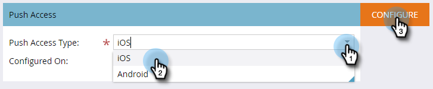
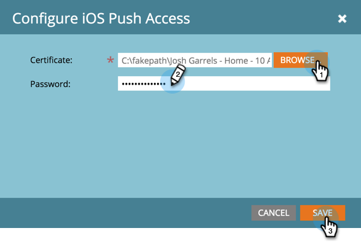

# モバイルアプリ iOS プッシュアクセスの設定 {#configure-mobile-app-ios-push-access}

1. 「**[!UICONTROL 管理者]**」をクリックします。

   

1. 「**[!UICONTROL モバイルアプリ]**」を選択します。

   

1. 目的のモバイルアプリを選択します。

   

1. 「[!UICONTROL プッシュアクセスタイプ]」で「iOS」を選択し、「**[!UICONTROL 設定]**」をクリックします。

   

   >[!NOTE]
   >
   >モバイルアプリ開発者の&#x200B;**[!UICONTROL 証明書]**&#x200B;と&#x200B;**[!UICONTROL パスワード]**&#x200B;が必要です。 開発者は Apple Developer Member Center にログインし、アプリ用のプッシュ通知証明書を設定してダウンロードし、その内容を書き出すことで、これらを取得します。 開発者は、書き出しをおこなう際にパスワードを設定します。 **重要**：証明書は、使用している環境（サンドボックスまたは実稼動環境）に適している必要があります。 Marketo 管理者またはモバイルアプリ開発者に確認してください。

1. [!UICONTROL 証明書]を選択し、[!UICONTROL パスワード]を入力して、「**[!UICONTROL 保存]**」をクリックします。

   

よくできました。 Android でもアプリを設定してください。

>[!MORELIKETHIS]
>
>[モバイルアプリ Android プッシュアクセスの設定](/help/marketo/product-docs/mobile-marketing/admin/configure-mobile-app-android-push-access.md)
