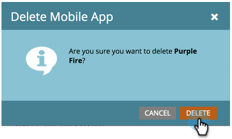

# モバイルアプリの削除 {#delete-mobile-app}

1. 「**[!UICONTROL 管理者]**」をクリックします。

   

1. 「**[!UICONTROL モバイルアプリ]**」を選択します。

   

1. 目的のモバイルアプリを選択します。

   

1. 「**[!UICONTROL モバイルアプリアクション]**」をクリックして「**[!UICONTROL アプリを削除]**」を選択します。

   

1. 「**[!UICONTROL 削除]**」をクリックして確認します。

   

いかがでしょうか。 このモバイルアプリからプッシュ通知を送信できなくなりました。
