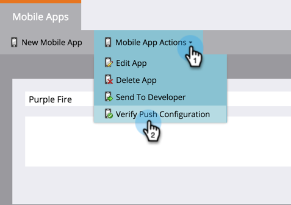

# プッシュ設定の検証 {#verify-push-configuration}

>[!NOTE]
>
>**前提条件**
>
>モバイルアプリには、モバイル開発者がMarketorのSDKコードを追加している必要があります。

すべての項目が適切に同期されるように、プッシュ設定を確認します。

1. 「 **管理者**」をクリックします。

   

1. 「 **モバイルアプリ**」を選択します。

   

   目的のモバイルアプリを選択します。

   

   「モバイルアプリのアクション」をクリックし、「プッシュ設定を検証」を選択します。

   

   確認済みの目的のプラットフォームを確認し、「CLOSE」をクリックします。

      準備完了！ プッシュ通知の送信開始 

>[!NOTE]
>
>**関連記事**
>
>* [プッシュ通知の作成](../../../product-docs/mobile-marketing/push-notifications/create-a-push-notification.md)

>

