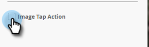

# 追加アプリ内メッセージ画像{#add-in-app-message-images}

アプリ内メッセージ画像を選択してカスタマイズする場所です。

1. アプリ内メッセージを選択し、「**ドラフトを編集**」をクリックします。

   

1. 「レイアウト」タブで、6つのテンプレートのいずれかを選択します。 「ポップアップ」には3つ、「フルスクリーン」には3つの選択肢があります。

   >[!TIP]
   >
   >テンプレートの違いは何ですか。 開始する前に、[アプリ内メッセージのレイアウトを選択](/help/marketo/product-docs/mobile-marketing/in-app-messages/creating-in-app-messages/choose-a-layout-for-your-in-app-message.md)を参照してください。

   

1. 「**スタイル**」タブをクリックし、テンプレートの画像領域をクリックします。

   

1. 「**画像を選択**」をクリックします。

   

1. Design Studioで画像を選択し、**「**&#x200B;を選択」をクリックします。

   

   >[!NOTE]
   >
   >画像サイズは1440 x 2560ピクセル、5MBに制限されています。

1. 考えを変えて、別の画像を使用したい場合 大丈夫。 画像ファイル名の横の&#x200B;**X**&#x200B;をクリックします。

   

1. 「**削除**」をクリックします。 別のものを選べます

   

1. 目的の画像を配置し、「画像プロパティ」で、「高さ」、「幅」または「両方」で画像に合わせるボタンを選択します。

   

1. オプションで、画像の境界線を適用します。 デフォルト設定は&#x200B;**オフ**&#x200B;です。 まず、色をクリックするか、カラーピッカーで16進数またはRGB数値を入力して、色を選択します。

   

1. 矢印をクリックして、境界線の幅をピクセル単位で変更します。 画像が変化するのがわかります。

   

1. スライダを使用して角丸の半径を選択します。 左から右の位置を選択します。0、4、8、12または16ピクセル。 初期設定は、8ピクセル（中央）の選択です。

   

1. 余白を選択します（オンまたはオフ）。 **デフォルト** 設定です。

   

1. 画像のタップ操作を定義する場合は、該当のチェックボックスをオンにします。

   

1. プラットフォームごとに個別のアクションがあります（注意を参照）。

   

1. 各ドロップダウンをクリックして、オプションを表示します。 いずれかを選択します。

   

   >[!NOTE]
   >
   >画像、ボタンまたは背景のタップアクションの場合、AppleプラットフォームとAndroidプラットフォームで異なるアクションを設定できます。 例えば、ディープリンクの処理方法がAppleとAndroidでは異なるとします。 メッセージの送信先のプラットフォームが1つだけの場合は、もう1つのプラットフォームをデフォルトの設定のままにするか、「**なし**」を選択します。

素晴らしい仕事！ これで、[アプリ内メッセージ](/help/marketo/product-docs/mobile-marketing/in-app-messages/creating-in-app-messages/create-in-app-message-text.md)のテキストを作成するタイミングになりました。

>[!MORELIKETHIS]
>
>* [アプリ内メッセージについて](/help/marketo/product-docs/mobile-marketing/in-app-messages/understanding-in-app-messages.md)
>* [アプリ内メッセージのレイアウトを選択](/help/marketo/product-docs/mobile-marketing/in-app-messages/creating-in-app-messages/choose-a-layout-for-your-in-app-message.md)

