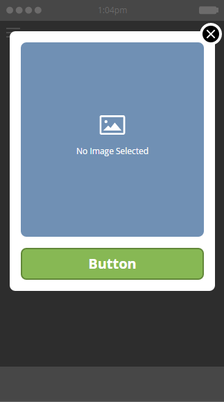
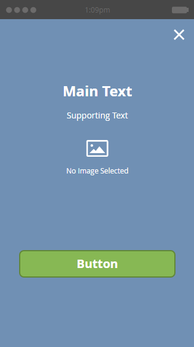

# アプリ内メッセージのレイアウトの選択 {#choose-a-layout-for-your-in-app-message}

Marketo は、アプリ内メッセージの作成に使用できるう 6 種類のレイアウトを提供しています。

* ポップアップレイアウトは従来の方法であり、コンテンツを提供するクリエイティブチームを設けておらず、特定のルックアンドフィールが必要ない場合に最適です。Marketo 内で、独自のアプリ内メッセージを簡単に作成および編集できます
* 全画面レイアウトを使用すると、完成したデザインを独自に読み込み、グラフィックを柔軟に表示できます

## ポップアップレイアウト {#pop-up-layouts}

3 つのポップアップレイアウトは、画像、テキスト、ボタン、背景を含む、すべてのオファープリセットデザイン要素を提供します。

最初のポップアップレイアウトは、ほとんどの用途に適している、低解像度の画像でも正常に機能する、という理由から、デフォルトで選択されています。このレイアウトは、プラットフォームの標準フォント（Apple の場合は Helvetica、Android の場合は Roboto）を使用するので、スマートフォンやタブレットでは常に正しく表示されます。メイン画像と背景画像をアップロードして配置し、独自のメインテキストとサポートテキストを記述し、メインボタンと閉じるボタンを設定できます。テキストは、24 ピクセルの場合 3 行に制限されます。文字サイズを大きくすると、行数が少なくなります。

2 つ目のポップアップレイアウトでは、テキストボックスが削除され、高さの大きな画像用の領域が増えます。画像を読み込む前に、画像に任意のスタイルでテキストを追加し、画像をカスタマイズします。

3 つ目のポップアップレイアウトは、アプリ内メッセージで画像を使用する必要がない場合に最適です。2 つのボタンを使用して、メッセージ受信者にアクションを選択できます。テキストは 3 行に制限されます。文字サイズを大きくすると、使用可能な行数が少なくなります。

## 全画面表示レイアウト {#full-screen-layouts}

全画面表示スタイルの 3 つのレイアウトは、完成したグラフィックアートワークを読み込むためのものです。独自のフォントを選択し、任意の web ページやプロモーションに合わせてグラフィック内に埋め込みます。

1 つ目の全画面表示レイアウトでは、空白のキャンバスが表示されます。画像を引き伸ばしたり切り抜いたりせずに、アップロードした内容が正確に表示されます（以下の例を参照）。画像の形状に応じて、周囲に空白の領域を残し、縮小して合わせます。画像の一部は削除されません。

この水平画像は全幅で表示され、上下に空白が残っています。

2 つ目の全画面表示レイアウトでは、テキストフィールドとボタンが追加されます。

最初の全画面表示レイアウトとは異なり、このレイアウトは 3 つ目の全画面表示レイアウト（下）と共に、配置された画像を高さに合わせて拡大し、辺をトリミングします。元の画像に応じて、魅力的な背景画像を作成できます。この例では、上に示した画像と同じ画像を使用します。

3 つ目の全画面表示レイアウトは、2 つ目のボタンを除き、2 つ目のレイアウトと同じです。これにより、メッセージ受信者に、より多くのオプションを提供します。

これでテンプレートについて理解できました。次に、[アプリ内メッセージ画像を作成する](/help/marketo/product-docs/mobile-marketing/in-app-messages/creating-in-app-messages/add-in-app-message-images.md)際に、テンプレートを選択します。

>[!MORELIKETHIS]
>
>[アプリ内メッセージについて](/help/marketo/product-docs/mobile-marketing/in-app-messages/understanding-in-app-messages.md)
