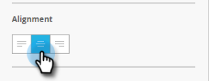
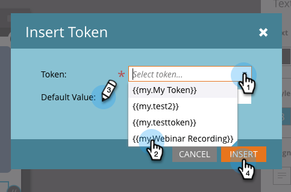

# アプリ内メッセージテキストの作成 {#create-in-app-message-text}

テキスト領域をクリックして、テキストスタイルとコンテンツを操作します。

1. インラインで編集するには、メインテキストをクリックします。

   

1. テキストの色を選択するには、テキストの色をクリックするか、カラーピッカーで16進数またはRGB数値を入力します。

   

1. 矢印をクリックして、テキストサイズを選択します。

   

   >[!CAUTION]
   >
   >テキストサイズが大きすぎると、コンテンツが表示可能なテキスト行の最大3行を超える場合があります。

1. オプションで、強調の種類を選択します。 **太字**、 *斜体*、または下線

   

1. テキストの配置を選択します。左、中央、右。 デフォルトは「中央揃え」です。

   

   >[!NOTE]
   >
   >広告でレンダリングされるテキストフォントは、各プラットフォームの標準フォントです。Helvetica for AppleおよびRoboto for Android

1. テキストのタップ操作を選択するには、チェックボックスをオンにします。

   

1. 各プラットフォームのタップアクションを選択します。AppleまたはAndroid。

   

   >[!NOTE]
   >
   >タップアクションについては、AppleプラットフォームとAndroidプラットフォームで異なるアクションを設定できます。 例えば、ディープリンクの処理方法がAppleとAndroidでは異なるとします。 メッセージの送信先が1つのプラットフォームのみである場合は、もう1つのプラットフォームをデフォルトの設定のままにするか、「なし」を選択します。

1. 「サポートするテキスト」をクリックして、インラインで編集します。 メインテキストの編集と同じように機能しますが、デフォルトのテキストサイズは小さくなります。

   

1. 「Main」または「Supporting」テキストのいずれかで、「Token」アイコンをクリックしてトークンを追加します。

   

1. ドロップダウンからマイトークンを選択し、デフォルト値を追加して、「 **挿入**」をクリックします。

   

   >[!NOTE]
   >
   >オプションとして使用できるのは、マイトークンのみです。 プログラムにマイトークンが設定されていない場合、トークンドロップダウンは空になります。

   >[!TIP]
   >
   >オーディエンスがトークンを表示する際に解決される文字数を考慮してください。 値が切り捨てられないように、長い値を考慮するのに十分な領域を残します。

   承認されたアプリ内メッセージプログラムで使用されるトークンに対して行った変更は、プログラムが一時停止されてから再開されるまで、アプリ内メッセージでは有効になりません。

君は金色だ。 次に、アプリ内メッセージボタンを [設定する必要があります](set-up-the-in-app-message-button.md)。

>[!MORELIKETHIS]
>
>* [アプリ内メッセージについて](../../../../product-docs/mobile-marketing/in-app-messages/understanding-in-app-messages.md)
>* [アプリ内メッセージのレイアウトを選択](choose-a-layout-for-your-in-app-message.md)

>

