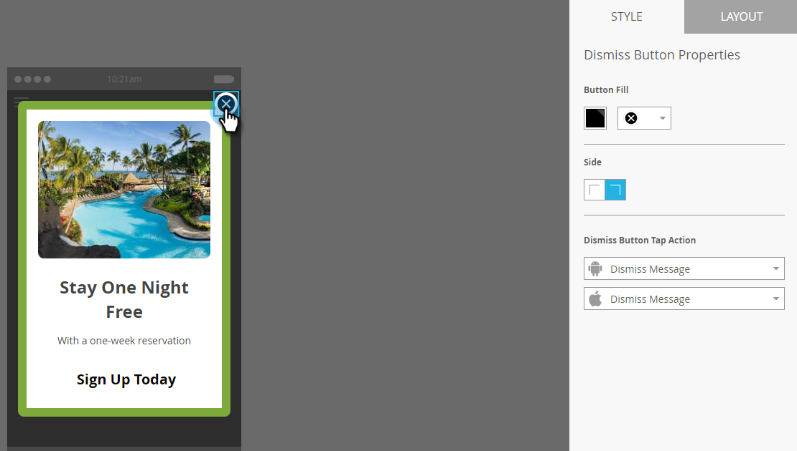
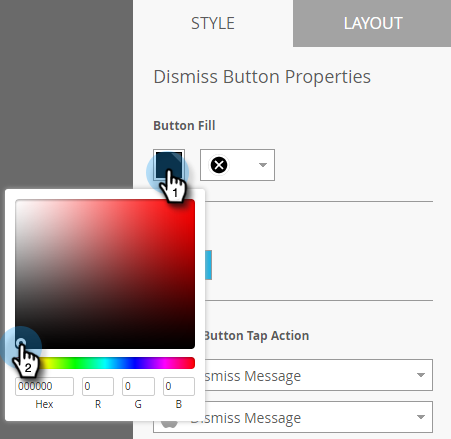
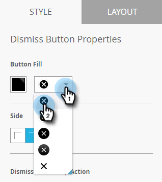
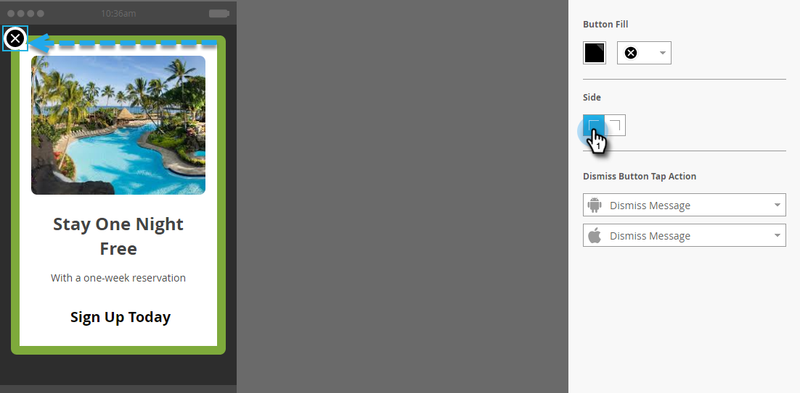
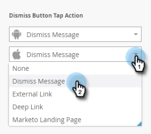
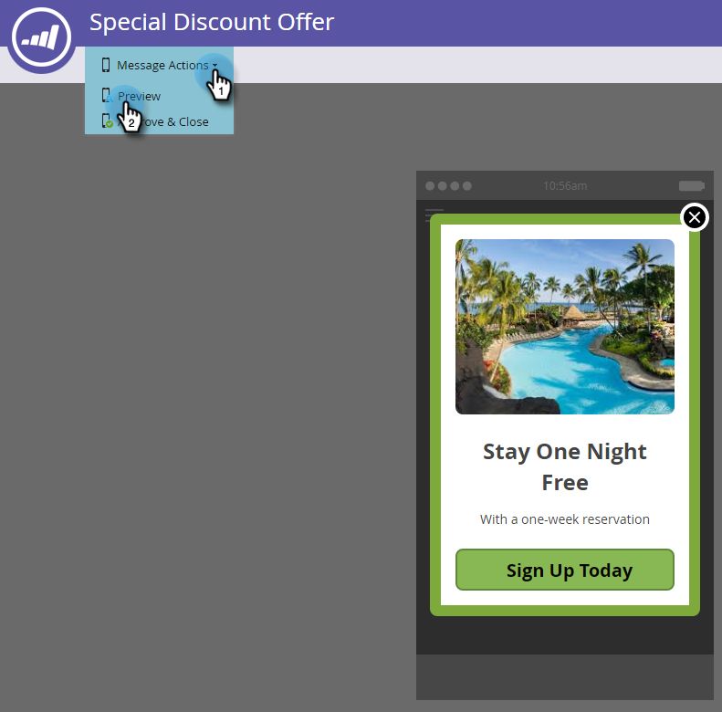
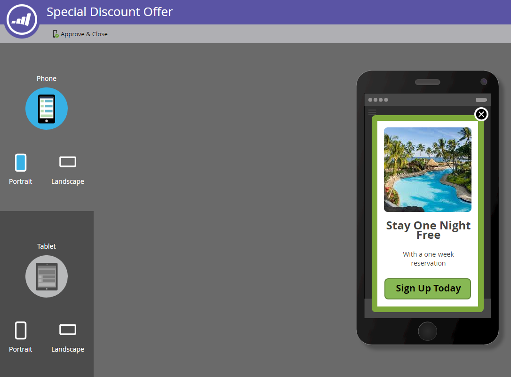
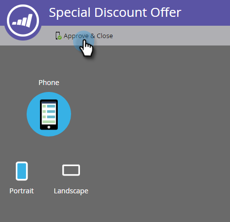
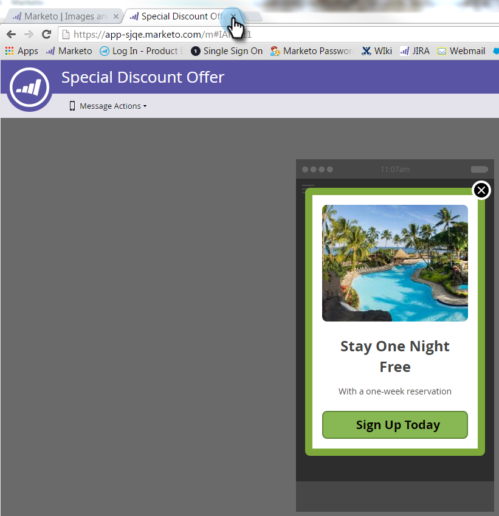

# 却下ボタンの設定とメッセージの承認 {#set-up-the-dismiss-button-and-approve-the-message}

## 「閉じる」ボタンプロパティを設定する  {#configure-dismiss-button-properties}

「閉じる」ボタンには、様々なオプションを使用して、好きなように設定できます。

1. エディターで、「閉じる」ボタンをクリックします。

   

1. ボタンの色を変更する場合は、色選択の四角形をクリックします。 色を選択するには、色をクリックするか、カラーピッカーで 16 進数または RGB 番号を入力します。 デフォルトは黒です。

   

1. ドロップダウンからボタンのデザインを選択します。 丸いボタンには、フルカラーとグラデーションオプションがあります。

   

   >[!CAUTION]
   >
   >ドロップダウンから別のデザインを選択すると、ボタンの色が白の背景に白の X で表示される場合があります。 その場合は、色選択の四角形で黒または別の色を選択して、白の X を表示します。

1. ボタンの左隅をクリックすると、「閉じる」ボタンを左に移動できます（デフォルトは右側です）。

   

1. 各プラットフォームのドロップダウンをクリックし、「閉じる」ボタンのタップアクションを選択します。

   

   >[!NOTE]
   >
   >「閉じる」ボタンにタップアクションを指定する必要があるので、このボタンを有効にするチェックボックスはありません。 「メッセージを閉じる」がデフォルト（明確な選択）です。

## まとめ {#wrap-it-up}

グラフィック、テキスト、ボタンの選択内容はすべて自動保存されました。 今、あなたは仕事を終える準備ができています。

1. アプリ内メッセージをプレビューするには、**[!UICONTROL メッセージアクション]**&#x200B;ドロップダウンをクリックして「**[!UICONTROL プレビュー]**」を選択します。

   

1. アプリ内メッセージが正しく表示されるかどうかをスマートフォンまたはタブレットでプレビューします。

   

1. アプリ内メッセージに問題がなければ、**[!UICONTROL 承認して閉じる]**&#x200B;をクリックします。

   

   >[!NOTE]
   >
   >[!UICONTROL メッセージアクション]ドロップダウンから直接「**[!UICONTROL 承認して閉じる]**」を選択することもできますが（手順 1 を参照）、安全のために、最初にメッセージをプレビューすることをお勧めします。

1. 承認せずにエディターを閉じるには、タブを閉じます。 自動保存されているので、後で戻って承認できます。

   

選択肢は多いですが、アプリ内メッセージが素晴らしく、すぐに使える状態になりました。

メッセージを[送信する時間です](/help/marketo/product-docs/mobile-marketing/in-app-messages/sending-your-in-app-message/send-your-in-app-message.md)。

>[!MORELIKETHIS]
>
>* [アプリ内メッセージについて](/help/marketo/product-docs/mobile-marketing/in-app-messages/understanding-in-app-messages.md)
>* [アプリ内メッセージのレイアウトの選択](/help/marketo/product-docs/mobile-marketing/in-app-messages/creating-in-app-messages/choose-a-layout-for-your-in-app-message.md)
