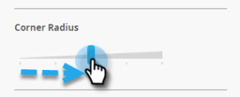

# アプリ内メッセージの背景の設定{#set-up-the-in-app-message-background}

メッセージの背景を選択することは、アプリ内メッセージを終了する上で重要な手順です。

>[!TIP]
>
>背景画像の場合は、テクスチャとグラデーションが最適です。

1. エディターで、背景領域をクリックします。

   

1. 色を設定するには、[**色**]をクリックし、色選択正方形をクリックします。 色を選択するには、色をクリックするか、カラーピッカーで16進数またはRGBコードを入力します。

   

   >[!NOTE]
   >
   >通常は白（デフォルト）が推奨結果です。

1. 背景を使用する場合は、「**画像**」をクリックし、「**画像を選択**」リンクをクリックします。

   

1. Design Studioにアップロードされたファイルから選択します。 「****&#x200B;を選択」をクリックします。

   

   >[!NOTE]
   >
   >画像サイズは1440 x 2560ピクセル、5MBに制限されています。

1. 結果を評価します。 プレーンカラー、テクスチャ、またはグラデーションを適切に使用できます。

   

1. オプションで画像の境界線を適用します。 デフォルト設定は&#x200B;**オフ**&#x200B;です。 まず、色をクリックするか、カラーピッカーで16進数またはRGB数値を入力して、色を選択します。

   

1. 矢印をクリックして、境界線の幅を変更します。 この12ピクセル幅の緑の境界線は、アプリ内メッセージの外観を変更します。

   

1. スライダを使用して角丸の半径を選択します。 左から右の位置を選択します。0、4、8、12または16ピクセル。 初期設定は、8ピクセル（中央）の選択です。

   

1. 背景のタップ操作を設定する場合は、このチェックボックスをオンにします（デフォルトではオフ）。

   

   >[!NOTE]
   >
   >背景のタップアクションについては、AppleプラットフォームとAndroidプラットフォームで異なるアクションを設定できます。 例えば、ディープリンクの処理方法がAppleとAndroidでは異なるとします。 メッセージの送信先のプラットフォームが1つだけの場合は、もう1つのプラットフォームをデフォルトの設定のままにするか、「**なし**」を選択します。

   [「閉じる」ボタンを設定する](set-up-the-dismiss-button-and-approve-the-message.md)

   >[!NOTE]
   >
   >**関連記事**
   >
   >    
   >    
   >    * [アプリ内メッセージについて](../../../../product-docs/mobile-marketing/in-app-messages/understanding-in-app-messages.md)
   >    * [アプリ内メッセージの送信](http://docs.marketo.com/pages/viewpage.action?pageid=10617378)
   >    * [アプリ内メッセージのレイアウトを選択](choose-a-layout-for-your-in-app-message.md)

その仕事を終えるには、最後のステップはにです。