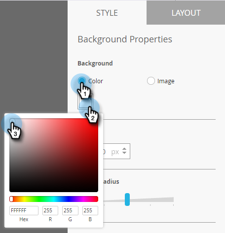

# アプリ内メッセージの背景の設定 {#set-up-the-in-app-message-background}

メッセージの背景の選択は、アプリ内メッセージを完了するための重要な手順です。

>[!TIP]
>
>背景画像の場合、テクスチャとグラデーションは通常最も効果的です。

1. エディターで、背景領域をクリックします。

   

1. 色を設定するには、「**カラー**」を選択し、次にカラー選択の四角形を選択します。色を選択するには、色をクリックするか、カラーピッカーで 16 進数または RGB コードを入力します。

   

   >[!NOTE]
   >
   >通常は白（デフォルト）が好まれます。

1. 背景を使用する場合は、「**画像**」をクリックしてから「**画像を選択**」リンクをクリックします。

   

1. Design Studio にアップロードされたファイルから選択します。「**選択**」をクリックします。

   

   >[!NOTE]
   >
   >画像サイズは 1440 x 2560 px および 5 MB に制限されます。

1. 結果を評価します。プレーンカラーかテクスチャかグラデーションの方が良いかもしれません。

   

1. オプションの画像の境界線を適用します。デフォルト設定は&#x200B;**オフ**&#x200B;です。まず、色をクリックするか、カラーピッカーで 16 進数または RGB 番号を入力して、色を選択します。

   

1. 矢印をクリックして境界線の太さを変更します。この 12 ピクセル幅の緑の境界線で、アプリ内メッセージの外観が変わります。

   

1. スライダーを使用して角丸の半径を選択します。左から右の位置（0、4、8、12 または 16 ピクセル）を選択します。8 ピクセル（中央）の選択がデフォルトです。

   

1. 背景のタップアクションを設定する場合は、このチェックボックスをオンにします（デフォルトではオフ）。

   

   >[!NOTE]
   >
   >背景のタップアクションの場合、Apple および Android プラットフォーム用に様々なアクションを設定できます。例えば、ディープリンクの処理は Apple と Android で異なります。メッセージの送信先が 1 つのプラットフォームのみの場合は、もう 1 つのプラットフォームをデフォルト設定のままにするか、「**なし**」を選択します。

   ジョブを完了するには、最後の手順は[「却下」ボタンの設定](/help/marketo/product-docs/mobile-marketing/in-app-messages/creating-in-app-messages/set-up-the-dismiss-button-and-approve-the-message.md)です。

   >[!MORELIKETHIS]
   >
   >* [アプリ内メッセージについて](/help/marketo/product-docs/mobile-marketing/in-app-messages/understanding-in-app-messages.md)
   >* [アプリ内メッセージの送信](/help/marketo/product-docs/mobile-marketing/in-app-messages/sending-your-in-app-message/send-your-in-app-message.md)
   >* [アプリ内メッセージのレイアウトの選択](/help/marketo/product-docs/mobile-marketing/in-app-messages/creating-in-app-messages/choose-a-layout-for-your-in-app-message.md)

