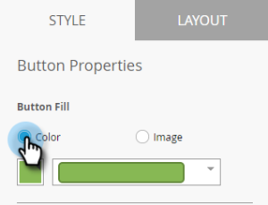

# アプリ内メッセージボタンの設定 {#set-up-the-in-app-message-button}

デフォルトのボタンデザインを使用したり、変更したり、独自のカスタムボタン画像をアップロードしたりできます。

1. ボタンをクリックして、編集用の「スタイル」タブを開きます。

   

1. 標準ボタンの色を変更するには、 **色** ボタンをクリックします。

   

1. 色選択四角形をクリックし、ボタンの色をクリックするか、カラーピッカーで16進数またはRGB数値を入力して選択します。

   

1. ドロップダウンで図形を選択します。 標準的な形状には、鋭い角、丸い角、グラデーションがあります。

   

1. ボタンに独自の画像を使用する場合は、画像ボタンをクリックし、「画像を **選択**」をクリックします。

   

1. 画像を選択し、「 **選択**」をクリックします。

   

   >[!TIP]
   >
   >ボタンのカスタム画像を配置する場合、既に画像にテキストが含まれている場合は、その上に配置されたプレースホルダーテキストをクリアすることを検討してください。

1. 色選択四角形をクリックし、フォントの色をクリックするか、カラーピッカーで16進数またはRGB数値を入力して選択します。

   

1. 矢印をクリックして、フォントサイズを選択します。

   

1. 強調するフォントスタイルを選択： **太字**、 *斜体*、または下線

   

1. ボタンのテキストをクリックして、インラインで編集します。

   

1. ボタンのタップ操作を設定する場合は、チェックボックスをオンにします。

   

   各プラットフォームのドロップダウンをクリックし、タップアクションを選択します。

   

   >[!NOTE]
   >
   >**Reminder**
   >
   >
   >ボタンには常にタップ操作があるので、「タップ操作」チェックボックスが自動的に選択され、デフォルトのメッセージは「メッセージを閉じる」になります。

   [アプリ内メッセージの背景を設定し、「閉じる」ボタンを](set-up-the-in-app-message-background.md)

もう少しで。 最後のステップはにです。

>[!MORELIKETHIS]
>
>* [アプリ内メッセージについて](../../../../product-docs/mobile-marketing/in-app-messages/understanding-in-app-messages.md)
>* [アプリ内メッセージのレイアウトを選択](choose-a-layout-for-your-in-app-message.md)

>

