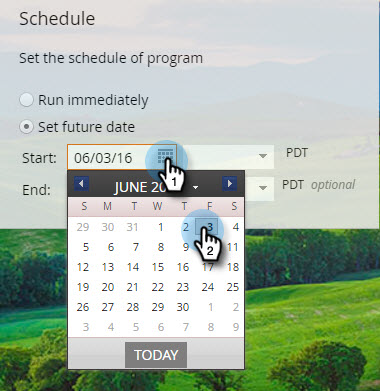
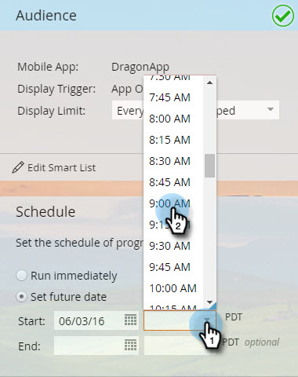
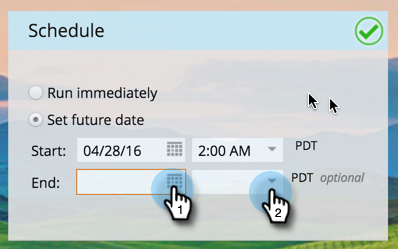
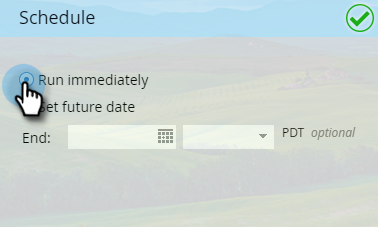

# アプリ内メッセージのスケジュール {#schedule-your-in-app-message}

今すぐメッセージを送信するか、後で送信するようにスケジュールを設定します。

1. アプリ内メッセージをスケジュールするには、「**[!UICONTROL 将来の日付を設定]**」を選択し、ドロップダウンカレンダーから開始日を選択します。

   

1. ドロップダウンから開始時刻を選択します。

   

1. 終了日と終了時刻はオプションです。ドロップダウンから選択します。

   

1. または、今すぐプログラムを実行するには、「**[!UICONTROL 今すぐ実行]**」を選択します。 「開始日」フィールドが非表示になります。

   

簡単です。 最後は、最も重要な[承認](/help/marketo/product-docs/mobile-marketing/in-app-messages/sending-your-in-app-message/approve-your-in-app-message.md)ステップです。
