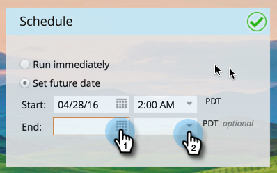

# アプリ内メッセージのスケジュール{#schedule-your-in-app-message}

今すぐメッセージを送信するか、後で送信するようにスケジュールします。

1. アプリ内メッセージのスケジュールを設定するには、「**将来の日付を設定**」を選択し、ドロップダウンカレンダーから開始日を選択します。

   

1. ドロップダウンから開始時間を選択します。

   

1. 終了日時はオプションです。ドロップダウンから選択します。

   

1. または、今すぐプログラムを実行するには、「**すぐに実行**」を選択します。 「開始日」フィールドが非表示になります。

   

簡単！ 最後ですが、少なくとも[承認](/help/marketo/product-docs/mobile-marketing/in-app-messages/sending-your-in-app-message/approve-your-in-app-message.md)ステップです。
