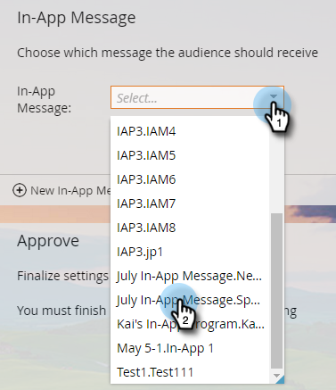

# アプリ内メッセージの選択 {#select-your-in-app-message}

ここで、プログラムで使用するために作成したメッセージを選択します。

1. ドロップダウンからアプリ内メッセージを選択します。

   

   >[!NOTE]
   >
   >すべてのメッセージは、場所に関係なく、選択できます。 各ファイルが一意の名前を受け取るように、親名がそれぞれに追加されます。

1. メッセージを選択したら、準備完了です。 編集またはプレビューできます。

   

   >[!TIP]
   >
   >別のメッセージを選択するには、「[!UICONTROL アプリ内メッセージ]」フィールドで削除します。 次に、[!UICONTROL 新しいアプリ内メッセージ]リンクが戻ります。 それをクリックし、別のメッセージを選択します。

君の言うことは本当に順調だ。 次に、[送信のスケジュールを設定](/help/marketo/product-docs/mobile-marketing/in-app-messages/sending-your-in-app-message/schedule-your-in-app-message.md)します。
