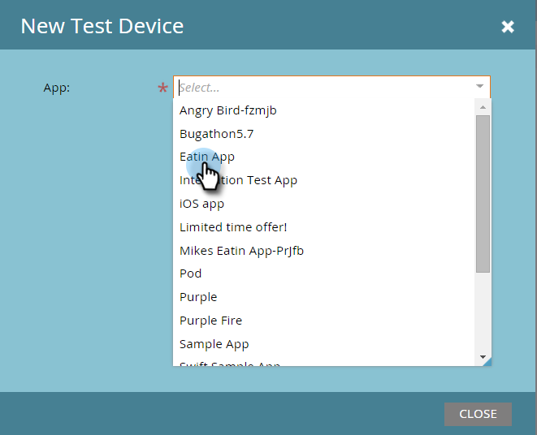

# 新しいテストデバイスの追加{#adding-a-new-test-device}

プッシュ通知用の新しいテストデバイスを簡単に追加できます。

>[!NOTE]
>
>**必要な管理者権限**

1. 「**管理者**」をクリックし、「**モバイルアプリ**」リンクをクリックします。\
   

1. 「**テストデバイス**」タブをクリックし、「**新しいテストデバイス**」をクリックします。

   

1. アプリを選択します。

   

1. デバイスをアプリに接続する方法は2つあります。

   最初のオプションでは、フィールドからURLをコピーし、電子メールまたはテキストメッセージでデバイスに送信します。 デバイスから、URLをタップします。

   

   2つ目のオプションを選択した場合は、2つ目のボタンをクリックし、デバイスでQRコードをスキャンします。

   

1. アプリが開きます。 デバイスに名前を付け、**はい**&#x200B;をタップします。

   

   成功！

   

1. ステータスが更新され、デバイスが追加されたことを示します。 おめでとう！

   

