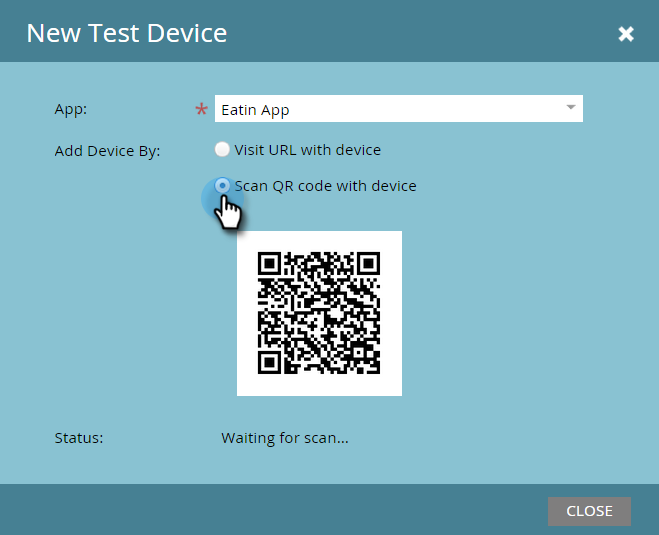
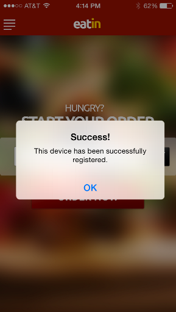
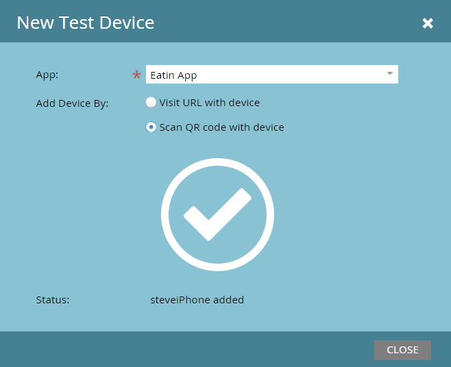

# 新しいテストデバイスの追加 {#adding-a-new-test-device}

通知をプッシュする新しいテストデバイスを簡単に追加できます。

>[!NOTE]
>
>**管理者権限が必要**

1. **[!UICONTROL 管理者]**／**[!UICONTROL モバイルアプリ]**&#x200B;リンクをクリックします。

   

1. 「**[!UICONTROL テストデバイス]**」タブをクリックして、「**[!UICONTROL 新しいテストデバイス]**」をクリックします。

   

1. アプリを選択します。

   

1. デバイスをアプリに接続するには、2 つの方法があります。

   1 つ目のオプションを使用する場合は、フィールドから URL をコピーし、メールまたはテキストメッセージでデバイスに送信します。 デバイスで、URL をタップします。

   

   または、2 つ目のオプションで、2 つ目のボタンをクリックし、デバイスで QR コードをスキャンします。

   

1. アプリが開きます。 デバイスに名前を付けて「**[!UICONTROL はい]**」をタップします。

   

   成功

   

1. ステータスが更新され、デバイスが追加されたことが示されます。 これで完了です。

   
