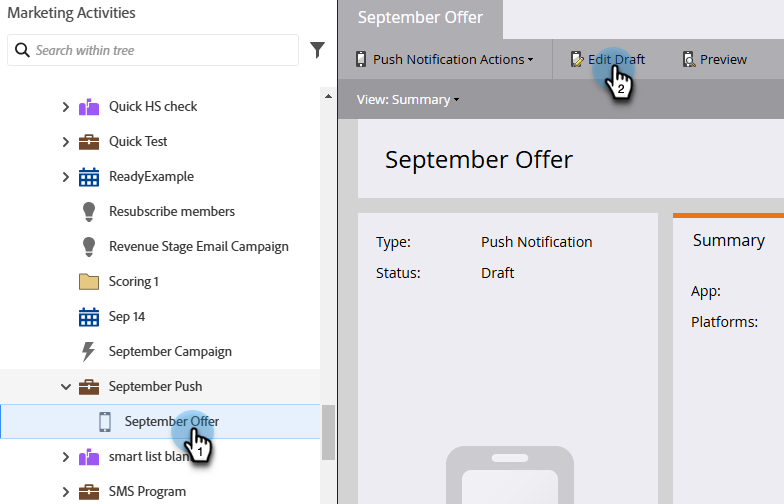
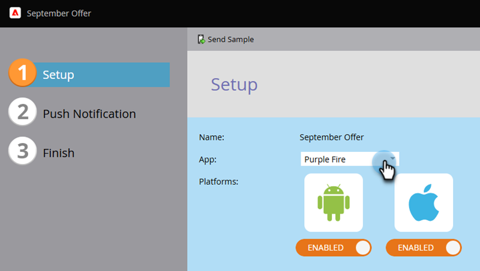
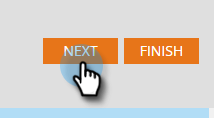
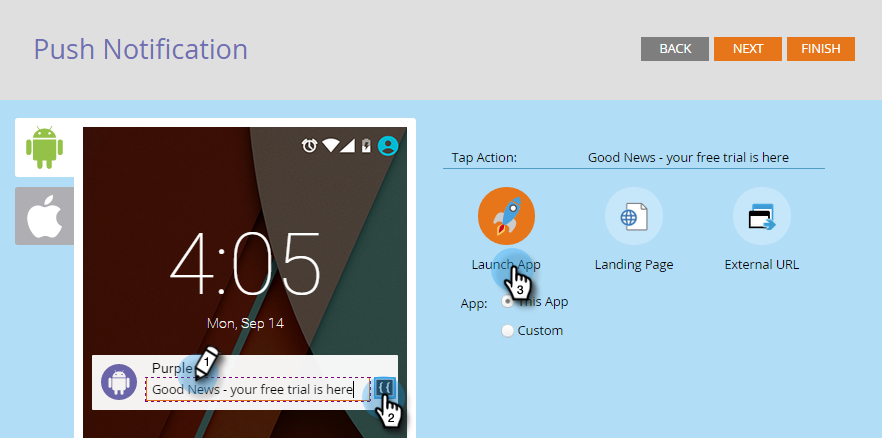
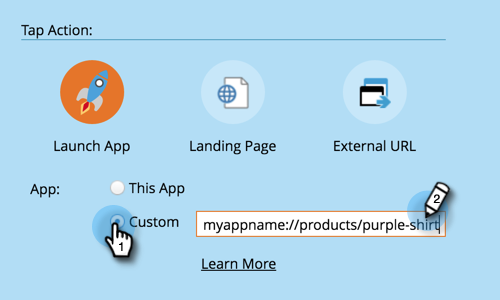
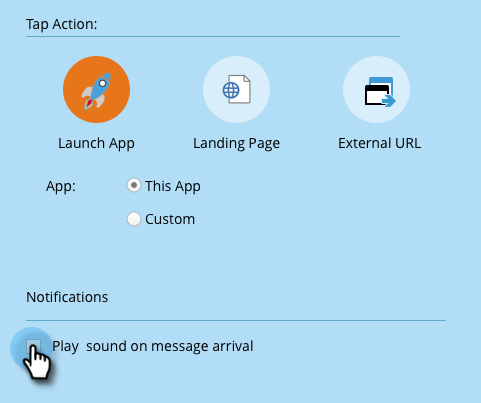
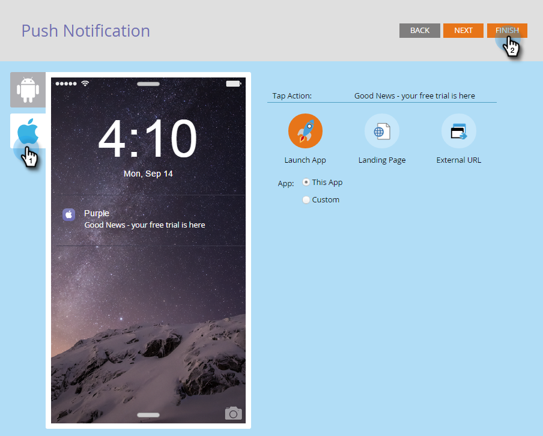
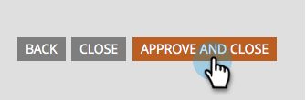
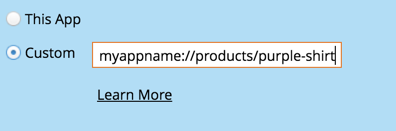

# モバイルプッシュ通知の設定 {#configure-mobile-push-notification}

1. 「**[!UICONTROL マーケティング活動]**」領域に移動します。

   

1. プッシュアセットを選択して、「**[!UICONTROL ドラフトを編集]**」をクリックします。

   

1. **設定**&#x200B;で、目的のアプリを選択します。 Android および Apple プラットフォームは、デフォルトで有効になっています。

   

   >[!NOTE]
   >
   >プッシュメッセージが1つのプラットフォーム（iOSなど）にのみ適用される場合は、セレクターを手動で&#x200B;**無効**&#x200B;にスライドすることで、他のプラットフォームを除外できます。

1. 「**[!UICONTROL 次へ]**」をクリックします。

   

1. メッセージテキストを入力するか、トークンアイコンを選択してトークンを追加します（このエディターでは、トークンは[通常どおり](/help/marketo/product-docs/demand-generation/landing-pages/personalizing-landing-pages/tokens-overview.md)の書式が設定されます。複数のトークンを使用できます）。 「**タップアクション**」を選択します。

   

   >[!NOTE]
   >
   >プラットフォームが有効な場合は、電話の画面表示の左側に表示されます。 選択するとカラーで表示されます。

   >[!NOTE]
   >
   >[!UICONTROL タップアクション]には次の 3 つのタイプがあります。
   >
   >**アプリを起動** - **このアプリ**&#x200B;通知をタップすると、アプリのホームページが開きます。 **カスタム**&#x200B;は、アプリの他の領域を開くためにディープリンクを使用します（「[ディープリンク URI](#deep-link-uris)」を参照)。
   >
   >**[!UICONTROL ランディングページ]** - 指定した Marketo ランディングページに移動します。
   >
   >**[!UICONTROL 外部 URL]** - Marketo 以外のランディングページに移動します。

1. カスタムのタップアクション用のディープリンクを挿入するには、「**カスタム**」を選択し、フィールドに [ディープリンク URI](#deep-link-uris) を入力します。

   

1. IOSの場合は、チェックボックスをオンにして、メッセージが届いたときにサウンドを再生するようにアプリに指示します。 Android ではサウンドは自動的に再生されます。

   

1. 他のプラットフォームをプレビューし、「**[!UICONTROL 完了]**」をクリックします。

   

1. 「**[!UICONTROL 承認して閉じる]**」をクリックします。

   

プッシュ通知を送信する準備ができました。

次のエラーが表示された場合：`Limited Access: You do not have sufficient privileges to perform this action`、**Access Design Studio** > `Access Landing Page`権限がユーザーに設定されていることを確認します。さらに、次のいずれか少なくとも1つを追加します。

* プッシュ通知の承認
* プッシュ通知を削除
* プッシュ通知の編集

## ディープリンク URI {#deep-link-uris}

購読者がプッシュメッセージのボタンをクリックすると、アプリのホームページに直接移動するか、アプリ内の特定のページに直接移動できます。 ディープリンクは、アプリ内の特定のページへの一意の参照で、web サイトリンクのように見えます。

ディープリンク URI は、スキーム名、パス、識別子の 3 つの部分で構成されます。 以下の例では、「myappname」がスキームです。 「products」はパスで、「purple-shirt」は識別子です。 顧客がタップすると、アプリの製品ページ内（具体的には紫色のシャツアイテム）に移動します。

ただし、アプリのディープリンク構造は、上記の例とは異なる場合があります。 開発者にはディープリンク URIを定義する多くのオプションがあるので、使用するページのURI （リンク）を開発者に送信するように依頼します。 これにより、プッシュメッセージに入力したURIが適切な場所を指すようにします。 デベロッパーが実行できる操作について詳しくは、[こちら](https://experienceleague.adobe.com/ja/docs/marketo-developer/marketo/mobile/enabling-deep-links-in-your-app)をご覧ください。

## リダイレクト URI {#redirect-uris}

プッシュ通知メッセージで設定されたリダイレクト URIは、その中でMarketo トークンをサポートします。 「Launch App URL」にのみ適用できます。

サンプルフォーマット：

* 既存のアプリケーション形式：
  `com.onboardmd://financing?FirstName={{lead.First Name}}&City={{lead.City}}`

* フォールバック値を使用した書式設定：
  `com.onboardmd://financing?FirstName={{lead.First Name:default=edit me}}&City={{lead.City:default=edit me}}`

>[!MORELIKETHIS]
>
>[モバイルプッシュ通知の送信](/help/marketo/product-docs/mobile-marketing/push-notifications/send-a-mobile-push-notification.md)
