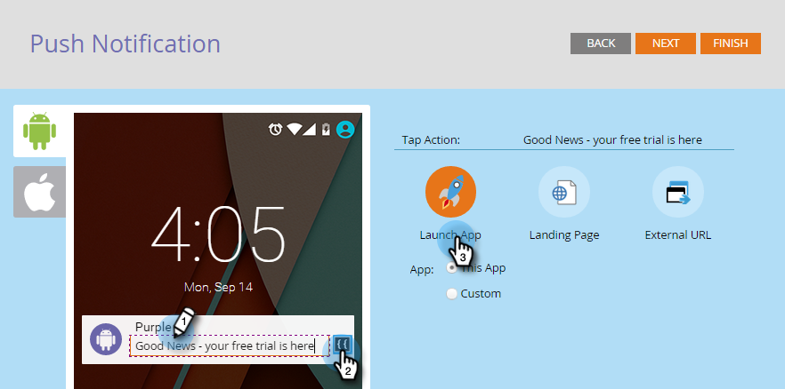

# モバイルプッシュ通知の設定 {#configure-mobile-push-notification}

1. **マーケティング活動**&#x200B;領域に移動します。

   

1. プッシュアセットを選択して、「**ドラフトを編集**」をクリックします。

   

1. **設定**&#x200B;で、目的のアプリを選択します。Android および Apple プラットフォームは、デフォルトで有効になっています。

   

   >[!NOTE]
   >
   >プッシュメッセージが 1 つのプラットフォーム（iOS など）にのみ適用される場合は、他のプラットフォームのセレクターを「**無効**」にスライドして除外できます。

1. 「**次へ**」をクリックします。

   

1. メッセージテキストを入力するか、トークンアイコンを選択してトークンを追加します（このエディターでは、トークンは[通常どおり](/help/marketo/product-docs/demand-generation/landing-pages/personalizing-landing-pages/tokens-overview.md)の書式が設定されます。複数のトークンを使用できます）。「**タップアクション**」を選択します。

   

   >[!NOTE]
   >
   >プラットフォームが有効な場合は、電話の画面表示の左側に表示されます。選択すると、色で表示されます。

   >[!NOTE]
   >
   >タップアクションには次の 3 つのタイプがあります。
   >
   >**アプリを起動** - **このアプリ**&#x200B;通知をタップすると、アプリのホームページが開きます。**カスタム**&#x200B;は、アプリの他の領域を開くためにディープリンクを使用します（「[ディープリンク URI](#deep-link-uris)」を参照)。
   >
   >**ランディングページ** - 指定した Marketo ランディングページに移動します。
   >
   >**外部 URL** - Marketo 以外のランディングページに移動します。

1. カスタムのタップアクション用のディープリンクを挿入するには、「**カスタム**」を選択し、フィールドに [ディープリンク URI](#deep-link-uris) を入力します。

   

   >[!NOTE]
   >
   >メッセージとタップアクションは、両方のプラットフォームで同じように表示されます。

1. iOS のみの場合は、チェックボックスをオンにして、メッセージが届いたときにアプリにサウンドを再生するように指示します。Android ではサウンドは自動的に再生されます。

   

1. 他のプラットフォームをプレビューし、「**完了**」をクリックします。

   

1. 「**承認して終了**」をクリックします。

   

これで完了です。これで、プッシュ通知を送信する準備が整いました。

## ディープリンク URI {#deep-link-uris}

購読者がプッシュメッセージのボタンをクリックすると、アプリのホームページに直接移動するか、アプリ内の特定のページに直接移動できます。ディープリンクは、アプリ内の特定のページへの一意の参照で、web サイトリンクのように見えます。

ディープリンク URI は、スキーム名、パス、識別子の 3 つの部分で構成されます。以下の例では、「myappname」がスキームです。「products」はパスで、「purple-shirt」は識別子です。顧客がタップすると、アプリの製品ページ内（具体的には紫色のシャツアイテム）に移動します。

ただし、アプリのディープリンク構造は、上記の例とは異なる場合があります。デベロッパーには、ディープリンク URI を定義する多くのオプションがあるので、使用したいページの URI（リンク）をデベロッパーに送信するよう依頼してください。これにより、プッシュメッセージに入力した URI が適切な場所を指すようになります。デベロッパーが実行できる操作について詳しくは、[こちら](https://experienceleague.adobe.com/ja/docs/marketo-developer/marketo/mobile/enabling-deep-links-in-your-app)をご覧ください。

>[!MORELIKETHIS]
>
>[モバイルプッシュ通知の送信](/help/marketo/product-docs/mobile-marketing/push-notifications/send-a-mobile-push-notification.md)
