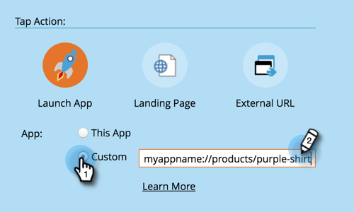

# モバイルプッシュ通知の設定 {#configure-mobile-push-notification}

1. **[!UICONTROL マーケティング活動]**&#x200B;領域に移動します。

   

1. プッシュアセットを選択して、「**[!UICONTROL ドラフトを編集]**」をクリックします。

   

1. **設定**&#x200B;で、目的のアプリを選択します。Android および Apple プラットフォームは、デフォルトで有効になっています。

   

   >[!NOTE]
   >
   >プッシュメッセージが 1 つのプラットフォーム（iOSなど）のみに適用される場合は、セレクターを手動で **無効** にスライドすることで、他のプラットフォームを除外できます。

1. 「**[!UICONTROL 次へ]**」をクリックします。

   

1. メッセージテキストを入力するか、トークンアイコンを選択してトークンを追加します（このエディターでは、トークンは[通常どおり](/help/marketo/product-docs/demand-generation/landing-pages/personalizing-landing-pages/tokens-overview.md)の書式が設定されます。複数のトークンを使用できます）。「**タップアクション**」を選択します。

   

   >[!NOTE]
   >
   >プラットフォームが有効な場合は、電話の画面表示の左側に表示されます。選択すると、色で表示されます。

   >[!NOTE]
   >
   >[!UICONTROL タップアクション]には次の 3 つのタイプがあります。
   >
   >**アプリを起動** - **このアプリ**&#x200B;通知をタップすると、アプリのホームページが開きます。**カスタム**&#x200B;は、アプリの他の領域を開くためにディープリンクを使用します（「[ディープリンク URI](#deep-link-uris)」を参照)。
   >
   >**[!UICONTROL ランディングページ]** - 指定した Marketo ランディングページに移動します。
   >
   >**[!UICONTROL 外部 URL]** - Marketo 以外のランディングページに移動します。

1. カスタムのタップアクション用のディープリンクを挿入するには、「**カスタム**」を選択し、フィールドに [ディープリンク URI](#deep-link-uris) を入力します。

   

1. iOSの場合、メッセージの受信時にサウンドを再生するようにアプリに指示するには、チェックボックスをオンにします。 Android ではサウンドは自動的に再生されます。

   

1. 他のプラットフォームをプレビューし、「**[!UICONTROL 完了]**」をクリックします。

   

1. 「**[!UICONTROL 承認して終了]**」をクリックします。

   

プッシュ通知を送信する準備が整いました。

「`Limited Access: You do not have sufficient privileges to perform this action`」というエラーが表示された場合は、ユーザーに **Access Design Studio** > `Access Landing Page` 権限が設定されていることと、次のうち少なくとも 1 つが設定されていることを確認します。

* プッシュ通知の承認
* プッシュ通知を削除
* プッシュ通知の編集

## ディープリンク URI {#deep-link-uris}

購読者がプッシュメッセージのボタンをクリックすると、アプリのホームページに直接移動するか、アプリ内の特定のページに直接移動できます。ディープリンクは、アプリ内の特定のページへの一意の参照で、web サイトリンクのように見えます。

ディープリンク URI は、スキーム名、パス、識別子の 3 つの部分で構成されます。以下の例では、「myappname」がスキームです。「products」はパスで、「purple-shirt」は識別子です。顧客がタップすると、アプリの製品ページ内（具体的には紫色のシャツアイテム）に移動します。

ただし、アプリのディープリンク構造は、上記の例とは異なる場合があります。開発者はディープリンク URI を定義する際に多くのオプションを使用できるので、使用したいページの URI （リンク）を開発者に送信してもらってください。 これにより、プッシュメッセージに入力する URI が適切な場所を指すようになります。 デベロッパーが実行できる操作について詳しくは、[こちら](https://experienceleague.adobe.com/ja/docs/marketo-developer/marketo/mobile/enabling-deep-links-in-your-app)をご覧ください。

>[!MORELIKETHIS]
>
>[モバイルプッシュ通知の送信](/help/marketo/product-docs/mobile-marketing/push-notifications/send-a-mobile-push-notification.md)
