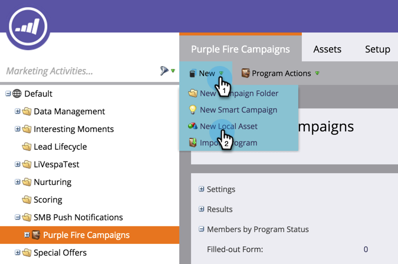

# プッシュ通知の作成{#create-a-push-notification}

プッシュ通知は簡単に作成できます。 ただし、開始する前に、マーケティング担当者とモバイルアプリ開発者に、開発の途中で必要な設定を依頼する必要があります。 詳しくは、[プッシュ通知について](understanding-push-notifications.md)を参照してください。

1. **マーケティングアクティビティ**&#x200B;エリアに移動します。

   

1. プログラムを探して選択します。

   

1. 「**新規**」で、「**新規ローカルアセット**」をクリックします。

   

1. 「**プッシュ通知**」を選択します。

   

1. **プッシュ通知名**&#x200B;を入力し、**作成**&#x200B;をクリックします。

   

   甘い！ プッシュ通知が作成されたら、[ドレスアップ](configure-mobile-push-notification.md)します。

