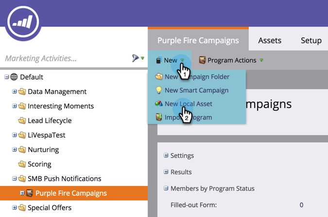

# プッシュ通知の作成 {#create-a-push-notification}

プッシュ通知の作成は簡単です。 ただし、開始する前に、Marketo管理者とモバイルアプリ開発者が必要な設定を行う必要があります。 詳しくは、「[プッシュ通知について](/help/marketo/product-docs/mobile-marketing/push-notifications/understanding-push-notifications.md)」を参照してください。

1. 「**[!UICONTROL マーケティング活動]**」領域に移動します。

   

1. プログラムを選択します。

   

1. 「**[!UICONTROL 新規作成]**」から「**[!UICONTROL 新規ローカルアセット]**」を選択します。

   

1. 「**[!UICONTROL プッシュ通知]**」を選択します。

   

1. 「**プッシュ通知名**」を入力して「**[!UICONTROL 作成]**」をクリックします。

   

   できましたね。 プッシュ通知が作成されたので、続けて[装飾](/help/marketo/product-docs/mobile-marketing/push-notifications/configure-mobile-push-notification.md)してみましょう。
