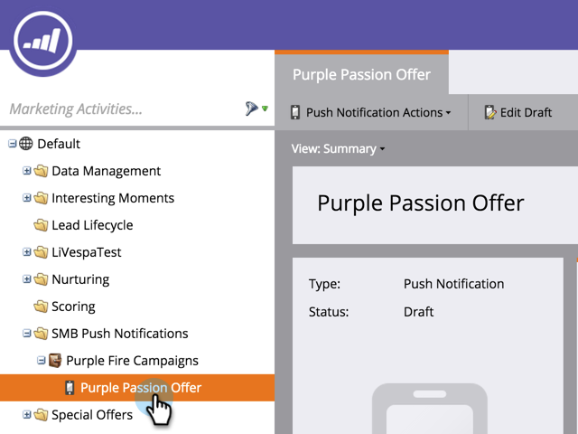
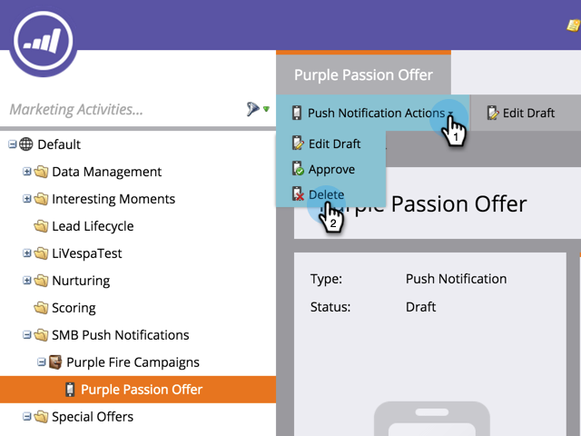

# モバイルプッシュ通知の削除 {#delete-mobile-push-notification}

1. **[!UICONTROL マーケティング活動]**&#x200B;領域に移動します。

1. モバイルプッシュ通知を見つけて選択します。

   

1. 「**[!UICONTROL プッシュ通知アクション]**」の下で、「**[!UICONTROL 削除]**」をクリックします。

   

1. 「**[!UICONTROL 削除]**」をクリックして確認します。

   

   >[!NOTE]
   >
   >モバイルプッシュ通知が他のアセットによって使用されている場合、そのモバイルプッシュ通知を削除することはできません。 そのアセットまで移動して、モバイルプッシュ通知をアセットから削除する必要があります。
