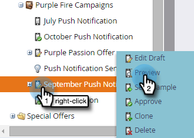
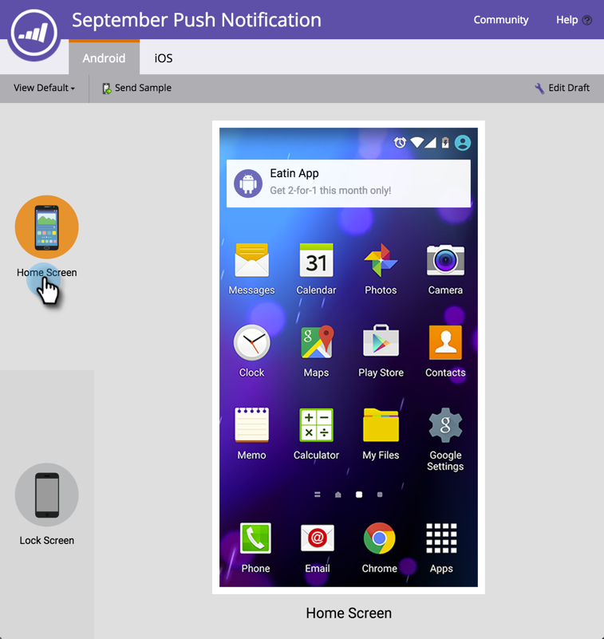
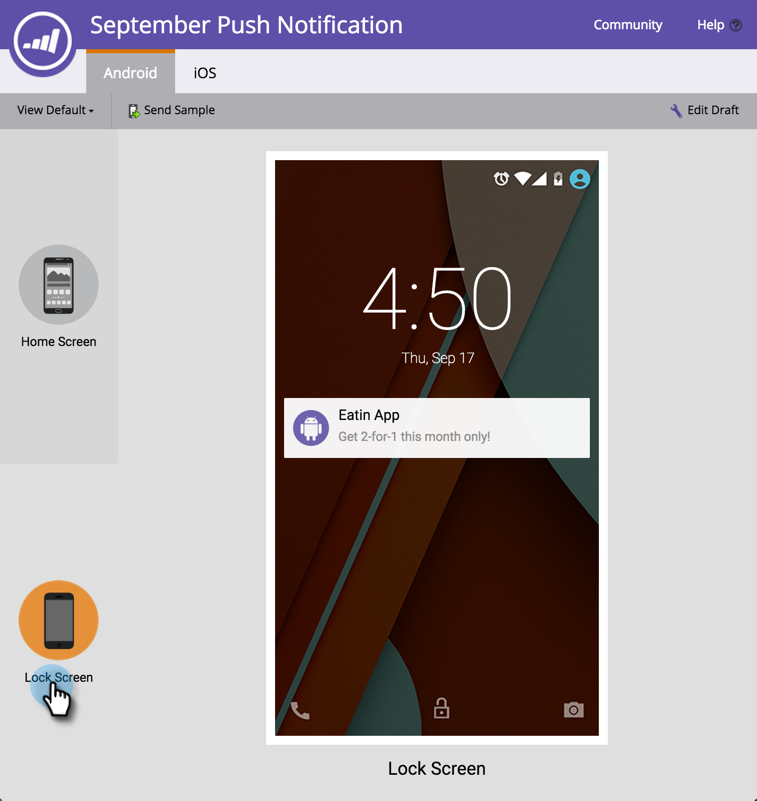
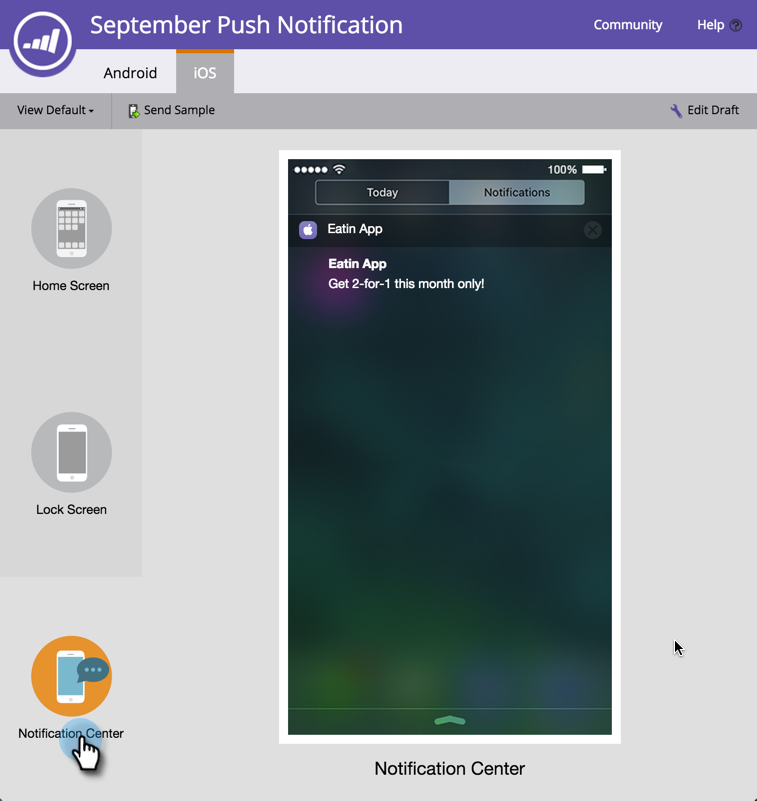

# プッシュ通知のプレビュー {#preview-a-push-notification}

AndroidやiOSのプッシュ通知を容易にプレビューできます。 これをおこなう方法は 4 つあります。

ナビゲーションツリーで、プレビューする通知のファイルを右クリックし、「**[!UICONTROL プレビュー]**」をクリックします。

>[!NOTE]
>
>プッシュ通知が1つのプラットフォームに対してのみ有効になっている場合、他のプラットフォームのタブは表示されません。

または、プッシュ通知ビューページで、**[!UICONTROL プッシュ通知アクション]**／**[!UICONTROL プレビュー]**&#x200B;をクリックします。 または、右端にある「**[!UICONTROL プレビュー]**」をクリックします。

最後に、エディタで、通知の作業中に右上の「**[!UICONTROL ドラフトをプレビュー]**」タブをクリックできます。

## Android プレビュー {#android-previews}

送信時にプッシュ通知が表示される場所を正確に確認するには、左側のアイコンをクリックします。 切り替えるには、キーボードの矢印をクリックまたは使用します。

ホーム画面では、通知が最上部から少し下のところにあるアイコンの下に表示されます。

ロック画面では、上下の真ん中あたりの時間の下にポップアップ表示されます。

>[!NOTE]
>
>Androidには通知センタービューがありません。

## iOS プレビュー {#ios-previews}

Android と同様に、キーボードの矢印をクリックまたは使用して表示を切り替えます。

ホーム画面の上部に通知が表示されます。

ロック画面では、上下の真ん中あたりに表示されます。

通知センターの画面では、一番上に表示されており，

したがって、プッシュ通知プレビューを使用すると、顧客に表示される内容を常に把握できます。

>[!MORELIKETHIS]
>
>* [プッシュ通知の作成](/help/marketo/product-docs/mobile-marketing/push-notifications/create-a-push-notification.md)
>* [モバイルプッシュ通知の設定](/help/marketo/product-docs/mobile-marketing/push-notifications/configure-mobile-push-notification.md)
