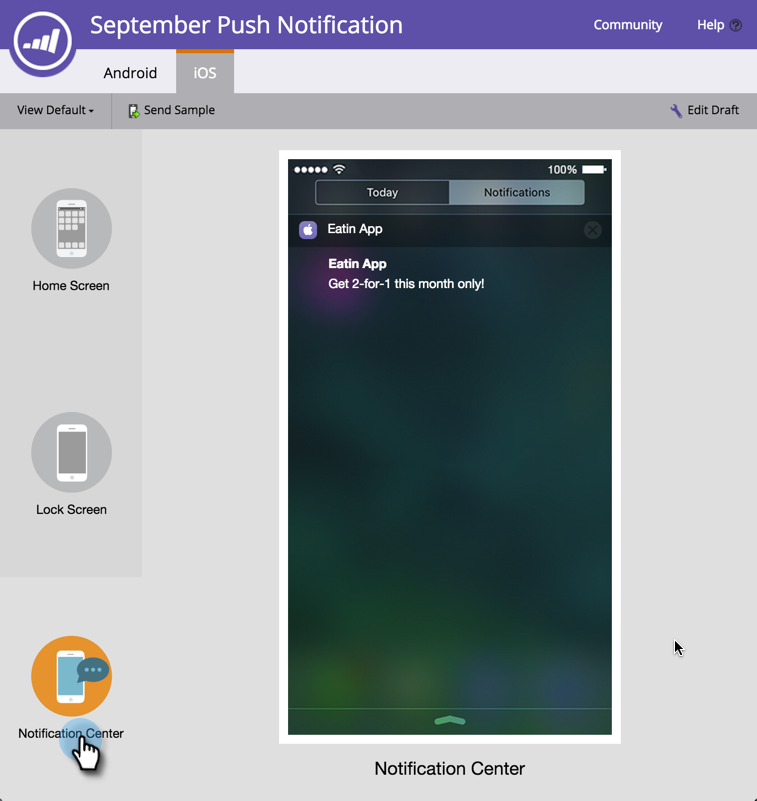

# プレビュープッシュ通知 {#preview-a-push-notification}

AndroidまたはiOSの場合、プッシュ通知の表示形式を簡単にプレビューできます。 4つの方法があります

ナビゲーションツリーで、プレビューする通知のファイルを右クリックし、「 **プレビュー**」をクリックします。

>[!NOTE]
>
>プッシュ通知が1つのプラットフォームに対してのみ有効になっている場合、他のプラットフォームのタブは表示されません。

または、プッシュ通知表示ページで、「 **プッシュ通知のアクション** 」をクリックし、「 **プレビュー**」をクリックします。 または、右端の「**プレビュー」 **をクリックします。** **

最後に、通知の作業中に、右上の「 **プレビュードラフト** 」タブをクリックします。

## Androidプレビュー {#android-previews}

左側のアイコンをクリックして、プッシュ通知を送信する際に表示される正確な場所を確認します。 をクリックするか、キーボードの矢印を使用して切り替えます。

ホーム画面の上部のアイコンの下に、通知が少し下に表示されます。

ロック画面では、時間の経過に伴って途中でポップアップします。

>[!NOTE]
>
>AndroidにはNotification Center表示はありません。

## iOSプレビュー {#ios-previews}

Androidと同様に、キーボードの矢印をクリックまたは使用して表示を切り替えます。

ホーム画面の上部に通知が表示されます。

ロック画面では、すぐに下に表示されます。

Notification Center画面の上部にあります。

したがって、プッシュ通知プレビューを使用すると、顧客に表示される内容を常に把握できます。

>[!MORELIKETHIS]
>
>* [プッシュ通知の作成](create-a-push-notification.md)
>* [モバイルプッシュ通知の設定](configure-mobile-push-notification.md)

>

