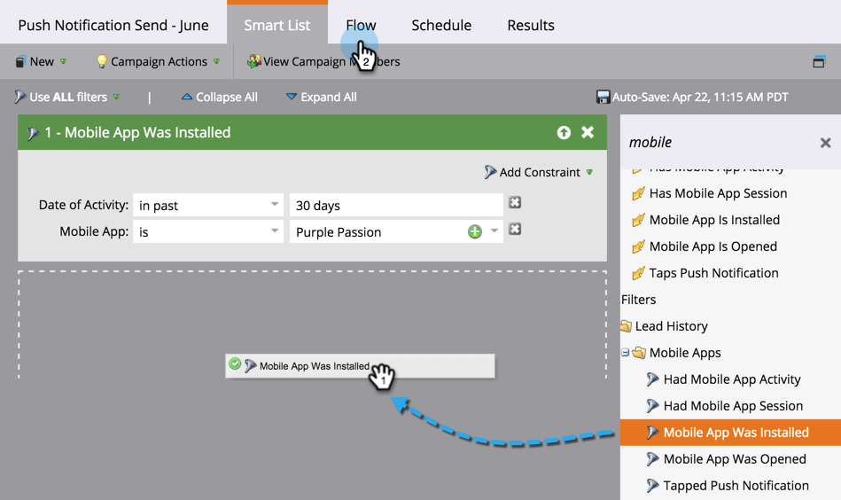
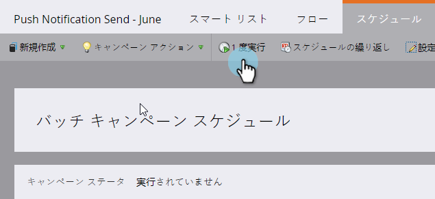
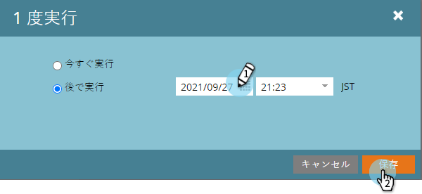

# モバイルプッシュ通知の送信 {#send-a-mobile-push-notification}

モバイルアプリを使用するユーザーにプッシュ通知を送信します。

>[!PREREQUISITES]
>
>* [新しいスマートキャンペーンの作成](../../../product-docs/core-marketo-concepts/smart-campaigns/creating-a-smart-campaign/create-a-new-smart-campaign.md)
>* [プッシュ通知の作成](create-a-push-notification.md)

>

1. 「 **マーケティングアクティビティ** 」領域に移動します。

   

1. スマートキャンペーンを選択し、「 **スマートリスト**」をクリックします。

   

1. スマートリストを定義し、「 **フロー」をクリックします。**

   

1. プッシュ通知を選択します。 「 **スケジュール」をクリックします**

   

   >[!NOTE]
   >
   >プッシュ通知は、ドロップダウンに表示される前に承認する必要があります。

1. 「1回 **実行」をクリックします**

   

1. 日時を選択します。 「 **保存」をクリックします。**

   

すぐに戻って、プッシュ通知が出るのを待ちます。