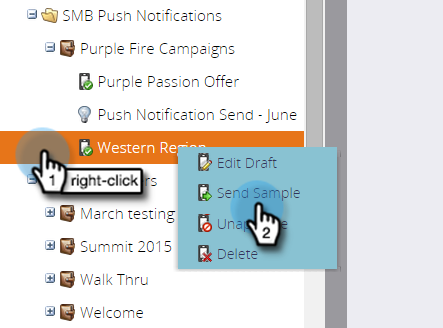

# プッシュ通知サンプルの送信{#send-a-push-notification-sample}

サンプルを送信して、プッシュ通知が正しく動作していることを確認できます。

>[!PREREQUISITES]
>
>サンプルを送信するデバイスにアプリがインストールされていることを確認します。

1. サンプルは次の3つの方法で送信できます。

   左側のツリーで、プッシュ通知アセットを右クリックし、「**サンプルを送信**」をクリックします。

   

   または、プッシュ通知アクションメニューで、「**サンプルを送信**」をクリックします。\
   

   または、プッシュ通知エディターで、「**サンプルを送信**」をクリックします。

   

1. 使用するテストデバイスが既に設定されている場合は、リストから選択します。

   

   または、「**追加デバイス**」をクリックして[新しいテストデバイス](adding-a-new-test-device.md)を追加し、サンプルを送信します。

   

1. デバイスをアプリに接続する方法は2つあります。

   最初のオプションで、「**デバイス**&#x200B;のURLにアクセス」ボタンをクリックし、フィールドからURLをコピーして、電子メールまたはテキストメッセージでデバイスに送信します。 デバイスから、URLをタップします。 ステータスに接続が表示されたら、「**送信**」をクリックします。

   

   または、2つ目のオプションで「**Scan QR code with device **」ボタンをクリックし、QRコードをデバイスでスキャンします。 ステータスに接続が表示されたら、「**送信**」をクリックします。

   

   >[!TIP]
   >
   >テストデバイスは正常に追加されましたが、**[**&#x200B;に送信]フィールドに表示されませんか。 トラブルシューティングするには、次を確認します。
   >
   >    
   >    
   >    * プッシュ通知は、プッシュ通知に関連付けられたアプリで有効になります。
      >    
      >    
      >
      >    
      >    
      >    

   * プッシュ通知は、テストデバイスのプラットフォームに合わせて設定されます。 例えば、iPhoneをテストデバイスとして追加した場合は、iOSでプッシュ通知が有効になっていることを確認します。

簡単！