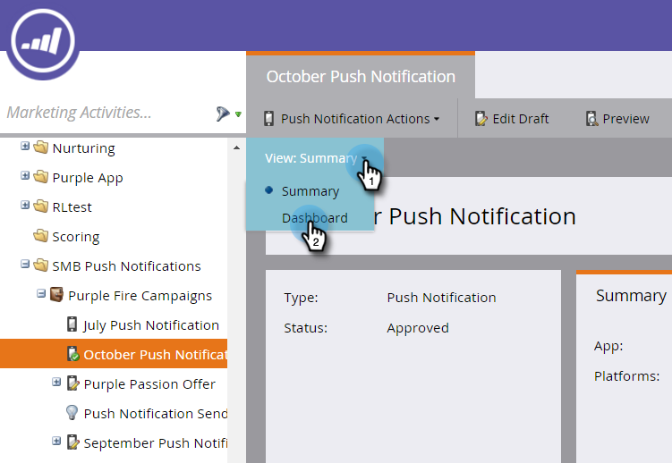

# プッシュ通知ダッシュボードの表示 {#view-the-push-notification-dashboard}

プッシュ通知の動作を簡単に確認できます。

1. 「 **マーケティングアクティビティ** 」領域に移動します。

   

1. キャンペーンを選択します。

   

1. クリック **表示:概要** 、 **ダッシュボード**。

   

1. 円グラフで、iOSおよびAndroidの送信合計と合計タップ数を表示できます。 下にスクロールすると、棒グラフで「タップの減衰」が表示されます。

   

   >[!NOTE]
   >
   >「 **送信済み** 」指標は、プッシュ通知の送信先となった人の正確な数よりも多くの送信を反映する場合があります。 これは、プッシュを受け取る資格のあるデバイスの *数に基づいて計算されるから* 。 例えば、1人の人が3台のデバイスを持っている場合、ダッシュボードは1台ではなく3台の送信を登録します。

   >[!NOTE]
   >
   >**関連記事**
   >
   >    
   >    
   >    * [プッシュ通知について](understanding-push-notifications.md)
   >    * [モバイルプッシュ通知の送信](send-a-mobile-push-notification.md)

