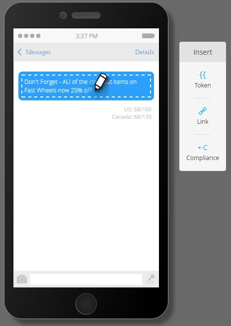
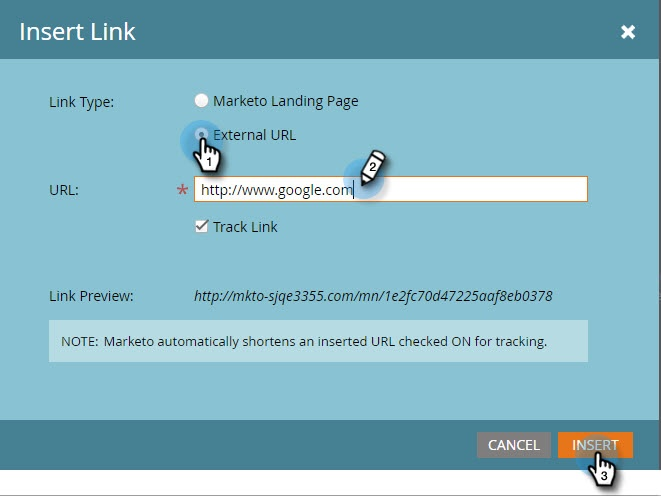

# Vibe SMSメッセージの作成 {#create-a-vibes-sms-message}

Vibes SMSメッセージの作成方法を次に示します。

1. 「マーケティングアクティビティ」に移動し、プログラムを右クリックします。

   

1. 「 **新規ローカルアセット**」をクリックします。

   

   >[!TIP]
   >
   >または、「 **新規** 」ドロップダウンをクリックします。

1. [ **SMSメッセージ**]をクリックします。

   

1. 新しいSMSメッセージの名前と説明（オプション）を入力し、[ **作成**]をクリックします。

   

1. 「ドラフト **を編集**」をクリックします。

   

1. メッセージエディターで、青い吹き出しの内側をクリックし、テキストの入力を開始します。

   

   >[!NOTE]
   >
   >米国とカナダの制限は異なり、それぞれ160文字と130文字です。 この文字数制限を超えると、メッセージが分割される場合があります。 カナダの制限を超えた場合は、エディターが米国向けに最適化され、米国の制限に基づいてメッセージが分割されます。

1. 挿入メニューの「 **トークン** 」をクリックして、メッセージにトークンを追加します。

   

   >[!NOTE]
   >
   >トークンを追加すると、メッセージが文字制限を超える場合があります。 その後、メッセージが分割され、追加料金が発生します。

1. 挿入メニューの「 **リンク** 」をクリックして、メッセージにリンクを追加します。

   

1. リンクタイプを選択します。 デフォルトはマーケティングランディングページです。 その場合は、ドロップダウンからランディングページを選択し、「 **挿入**」をクリックする必要があります。

   

   >[!NOTE]
   >
   >デフォルトでは、2つのトラッキングリンクが選択されています。

1. 代わりに外部URLを使用する場合は、「 **外部URL** 」ボタンをクリックし、「URL」フィールドにURLを入力します。 [ **挿入**]をクリックします。

   

1. メッセージにリンクが表示されます。

   

   >[!NOTE]
   >
   >Marketing Targetは、ブランド名を示すトラッキングドメインのリンクプレビューを表示します。 mkt_tokリンクのチェックボックスをオフにすると、リンクが変更されます。 「リンクを追跡」チェックボックスもオフにすると、URLが基本長に短縮されます(例：www.mygooglepage.com)。

   

   >[!NOTE]
   >
   >文字数は、最も低いメッセージに含まれる文字のみを反映します。

USの制限を超える数を挿入すると、エディターはメッセージをセクションに分割します。 900文字の絶対制限があります。 この制限に達すると、オーディエンスに送信する際に、自動的に切り捨てられます。