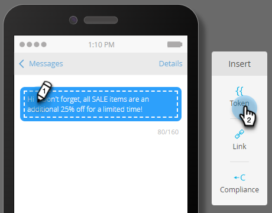
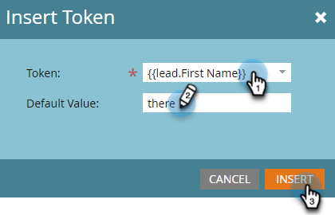

# SMS メッセージの作成 {#create-an-sms-message}

SMS メッセージの作成方法は次のとおりです。

>[!AVAILABILITY]
>
>この機能は、Adobe Marketo Engage アカウントのアドオンとして使用できます。適切にプロビジョニングするには、Adobeで購入する必要があります。 詳しくは、Adobeアカウントチーム（担当のアカウントマネージャー）にお問い合わせください。 Marketo Vibes SMS のネイティブ統合は、米国とカナダで利用できます。 他の国では、Marketoの Webhook を介した接続は、[Vibes に直接連絡 ](https://www.vibes.com/talk-to-sales) することで利用できます。

>[!PREREQUISITES]
>
>[LaunchPoint サービスとしての Vibes の追加 ](/help/marketo/product-docs/mobile-marketing/admin/add-vibes-as-a-launchpoint-service.md){target="_blank"}

1. 「**[!UICONTROL マーケティングアクティビティ]**」に移動します。

   

1. 目的のプログラムを右クリックし、「**[!UICONTROL 新しいローカルアセット]**」を選択します。

   

1. **SMS メッセージ** を選択します。

   

1. 新しい SMS メッセージの名前と説明（オプション）を入力し、「**作成**」をクリックします。

   

1. エディターで、青いバブルの内側をクリックしてテキストの入力を開始します。

   

   >[!NOTE]
   >
   >SMS メッセージの文字制限は、標準の ASCII 文字セットを使用する 160 文字です。 160 文字を超えると、メッセージは合計文字数に基づいて分割されます。

1. メッセージにトークンを追加するには、簡単な挨拶を書いて、「**トークン**」をクリックします。

   

   >[!NOTE]
   >
   >トークンを追加すると、メッセージの上限を超える場合があります。その後、メッセージは分割され、追加のメッセージが作成されます。

   >[!IMPORTANT]
   >
   >SMS コンプライアンス：すべてのアウトバウンド SMS メッセージには、ブランド名またはプログラムの説明を含める必要があります。 繰り返し発生するメッセージ プログラムに対して、ヘルプと停止の指示を購読者ごとに少なくとも月に 1 回は提供する必要があります。

1. 目的の **トークン** を選択し、オプションで **デフォルト値** を入力して、「**作成**」をクリックします。

   

1. リンクを追加するには、メッセージ内でリンクを表示する場所を選択し、「**リンク**」をクリックします。

   

1. リンクタイプを選択します。Marketo ランディングページがデフォルトです。その場合は、ランディングページ ドロップダウンをクリックし、目的のページを選択します。 終了したら **挿入** をクリックします。

   

   >[!NOTE]
   >
   >デフォルトでは、2 つのトラッキングリンクが選択されています。 「mkt_tok を含める」のチェックを外しても、リンクの追跡は可能ですが、リダイレクト後、宛先 URL には mkt_tok クエリ文字列パラメーターは含まれません。 このパラメーターは、ユーザーアクティビティ（ユーザーがオプトアウトした場合など）を適切にトラッキングするために、Marketo ランディングページと Munchkin で使用されます。

1. 外部 URL を使用する場合は、「**外部 URL**」を選択し、URL を入力/貼り付けて、「**挿入**」をクリックします。

   

   >[!NOTE]
   >
   >「リンクを追跡」を選択した状態を保つと、Marketoはトラッキング目的で URL を自動的に変更します。 トラッキングを無効にすることを選択した場合、URL はメッセージ内で変更されません（例：`www.adobe.com`）。

   >[!CAUTION]
   >
   >通信事業者がメッセージをスパムとしてフラグ付けする可能性があるので _URL 短縮機能（Bitly など）を使用_ しないことをお勧めします。

1. メッセージにリンクが表示されます。

   

   >[!NOTE]
   >
   >Marketo に、ブランド化されたトラッキングドメインのリンクプレビューが表示されます。mkt_tok リンクのチェックボックスをオフにすると、リンクが変更されます。

160 文字を超える文字を挿入すると、エディターが SMS をセクションに分割します。 メッセージは全体で 900 文字以内に制限されています。 これを超えると、メッセージは配信時に切り捨てられます。
