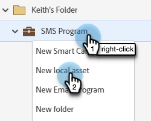
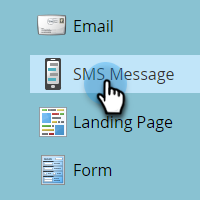
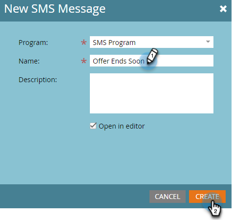
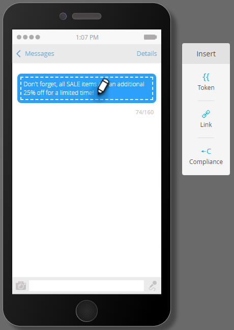
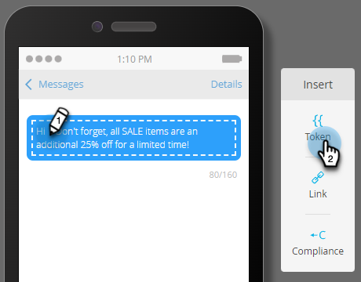
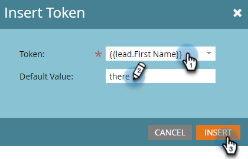
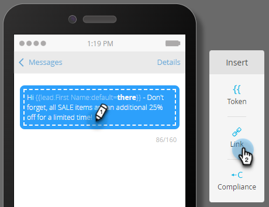
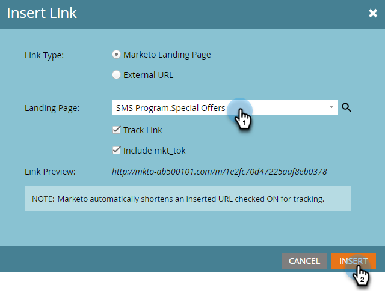
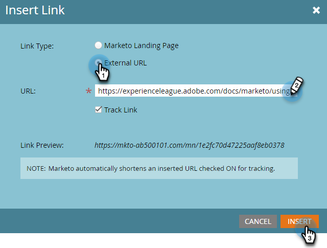
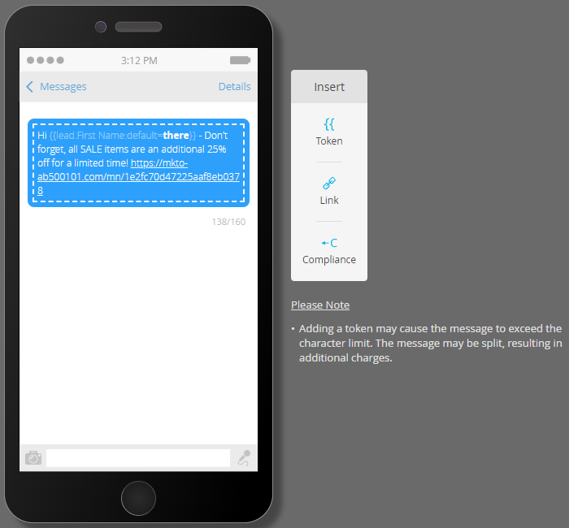

# SMS メッセージの作成 {#create-an-sms-message}

SMS メッセージの作成方法。

>[!AVAILABILITY]
>
>この機能は、Adobe Marketo Engage アカウントのアドオンとして使用できます。 これを適切にプロビジョニングするには、Adobeを通じて購入する必要があります。 詳しくは、アドビアカウントチーム（担当のアカウントマネージャー）にお問い合わせください。 Marketo Vibes SMSのネイティブ統合は、米国とカナダで利用可能です。 その他の国の場合、Marketo Webhook経由の接続は、[Vibesに直接お問い合わせいただくことで利用できます](https://www.vibes.com/talk-to-sales)。

>[!PREREQUISITES]
>
>[VibesをLaunchPoint サービスとして追加](/help/marketo/product-docs/mobile-marketing/admin/add-vibes-as-a-launchpoint-service.md){target="_blank"}

1. **[!UICONTROL マーケティングアクティビティ]**&#x200B;に移動します。

   

1. 目的のプログラムを右クリックし、**[!UICONTROL 新しいローカルアセット]**&#x200B;を選択します。

   

1. **SMS メッセージ**&#x200B;を選択します。

   

1. 新しい SMS メッセージの名前と説明（オプション）を入力し、「**作成**」をクリックします。

   

1. エディターで、青い吹き出しの中をクリックし、テキストの入力を開始します。

   

   >[!NOTE]
   >
   >SMS メッセージの文字制限は、標準のASCII文字セットを使用して160文字です。 160文字を超えると、合計文字数に基づいてメッセージが分割されます。

1. メッセージにトークンを追加するには、簡単な挨拶を書いて「**トークン**」をクリックします。

   

   >[!NOTE]
   >
   >トークンを追加すると、メッセージの上限を超える場合があります。 メッセージは分割され、追加のメッセージが作成されます。

   >[!IMPORTANT]
   >
   >SMS コンプライアンス：すべてのアウトバウンド SMS メッセージには、ブランド名またはプログラムの説明を含める必要があります。 定期的なメッセージプログラムについては、少なくとも月に1回は、ヘルプと停止の指示を提供する必要があります。

1. 必要な&#x200B;**トークン**&#x200B;を選択し、オプションの&#x200B;**デフォルト値**&#x200B;を入力して、**作成**&#x200B;をクリックします。

   

1. リンクを追加するには、メッセージの表示する場所を選択し、**リンク**&#x200B;をクリックします。

   

1. リンクタイプを選択します。 Marketo ランディングページがデフォルトです。 これを行う場合は、「ランディングページ」ドロップダウンをクリックし、目的のページを選択します。 完了したら、**挿入**&#x200B;をクリックします。

   

   >[!NOTE]
   >
   >デフォルトでは、2つのトラッキングリンクが選択されています。 「mkt_tokを含める」をオフにすると、リンクを追跡できますが、リダイレクト後は、宛先URLにmkt_tok クエリ文字列パラメーターが含まれなくなります。 このパラメーターは、Marketo ランディングページおよびMunchkinで使用され、個人のアクティビティを適切に追跡するために使用されます（例えば、ユーザーがオプトアウトした場合など）。

1. 代わりに外部URLを使用する場合は、**外部URL**&#x200B;を選択し、URLを入力または貼り付けて、**挿入**&#x200B;をクリックします。

   

   >[!NOTE]
   >
   >「リンクをトラッキング」を選択すると、Marketoはトラッキング用にURLを自動的に変更します。 トラッキングを無効にする場合、URLは変更されずにメッセージに表示されます（例：`www.adobe.com`）。

   >[!CAUTION]
   >
   >このメッセージは迷惑メールとしてフラグ付けされる可能性があるため、URL短縮サービス （Bitlyなど）を使用することは&#x200B;_お勧めしません_。

1. メッセージにリンクが表示されます。

   

   >[!NOTE]
   >
   >Marketo に、ブランド化されたトラッキングドメインのリンクプレビューが表示されます。 mkt_tok リンクチェックボックスをオフにすると、リンクが変更されます。

160文字を超える文字を挿入すると、エディターはSMSをセクションに分割します。 1つのメッセージにつき900文字の全体的な制限があります。 これを超えると、メッセージは配信時に切り捨てられます。
