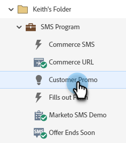
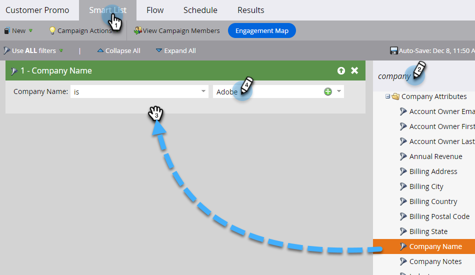
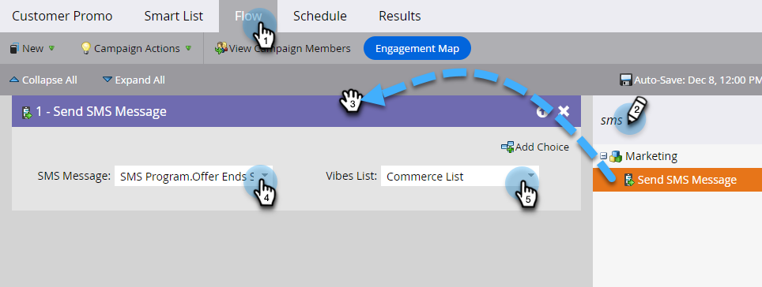
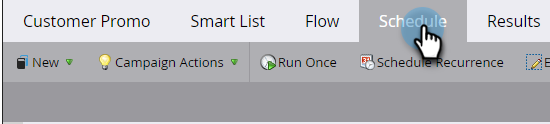
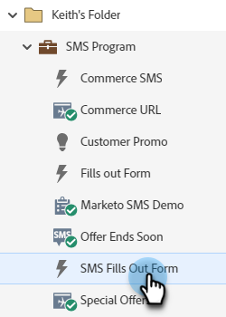
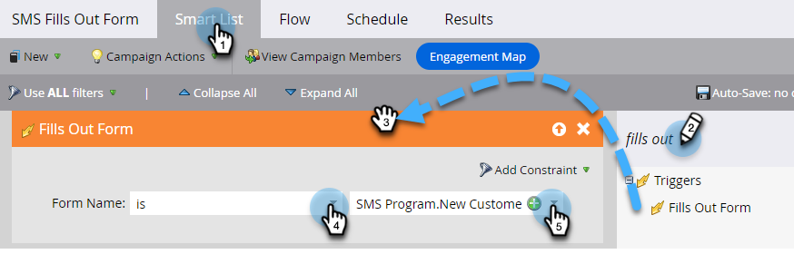
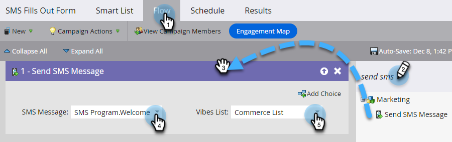
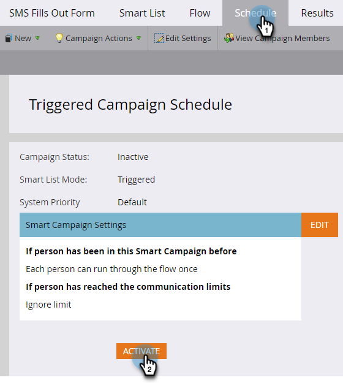

# SMS メッセージの送信 {#send-a-vibes-sms-message}

SMS メッセージを[作成しました](/help/marketo/product-docs/mobile-marketing/vibes-sms-messages/create-an-sms-message.md){target="_blank"}。次に送信します。 バッチまたはトリガーキャンペーンで送ることができます。

>[!NOTE]
>
>SMS メッセージを送信する場合：
>
>* 電話番号によるMarketo Engageの重複排除。 そのため、複数のユーザーが同じ電話番号を持っている場合、1人のユーザーのみが1つのVibes サブスクリプションリストのメンバーである場合、メッセージを受け取ります。 重複排除は、Marketo プログラムレベルではなく、Vibes サブスクリプションのリストレベルで行われます。
>* メッセージはブロックリストに登録されたリードやマーケティングが中断されたリードには送信されません。
>* Vibes Mobile Database リストに登録されていないユーザーにSMS メッセージを送信することはできません。

## バッチ SMSの送信 {#send-a-batch-sms}

1. My Marketo で、**マーケティング活動**&#x200B;をクリックします。

   

1. 目的のスマートキャンペーンを検索して選択します。

   

1. 「**スマートリスト**」タブをクリックし、SMSのオーディエンスを定義します。 この例では、データベース内の「Adobe」が会社としてリストされている全員に送信します。

   

1. **フロー** タブで、**SMS メッセージを送信**&#x200B;にドラッグします。 ドロップダウンから目的のSMS メッセージとVibes リストを選択します。

   

   >[!NOTE]
   >
   >Vibes リストセレクターは、スマートリストですでに特定されているオーディエンスをさらにフィルターとして機能し、そのVibes リストに属するユーザーのみをターゲットにします。

1. 「**スケジュール**」タブをクリックし、SMSをスケジュールします。

   

## トリガーSMSの送信 {#send-a-trigger-sms}

1. My Marketo で、**マーケティング活動**&#x200B;をクリックします。

   

1. 目的のスマートキャンペーンを検索して選択します。

   

1. 「**スマートリスト**」タブをクリックし、目的のトリガーを選択して、その値を定義します。 この例では、**入力フォーム**&#x200B;を使用しています。

   

1. **フロー** タブで、**SMS メッセージを送信**&#x200B;にドラッグします。 ドロップダウンから目的のSMS メッセージとVibes リストを選択します。

   

   >[!NOTE]
   >
   >Vibes リストセレクターは、スマートリストですでに特定されているオーディエンスをさらにフィルターとして機能し、そのVibes リストに属するユーザーのみをターゲットにします。

1. 「**スケジュール**」タブをクリックし、**アクティブ化**&#x200B;をクリックします。

   

>[!MORELIKETHIS]
>
>* [Vibes メッセージの作成](/help/marketo/product-docs/mobile-marketing/vibes-sms-messages/create-an-sms-message.md){target="_blank"}
>* [&#x200B; スマートキャンペーンでのSMS オプションの使用](/help/marketo/product-docs/mobile-marketing/vibes-sms-messages/using-sms-options-in-a-smart-campaign.md){target="_blank"}
